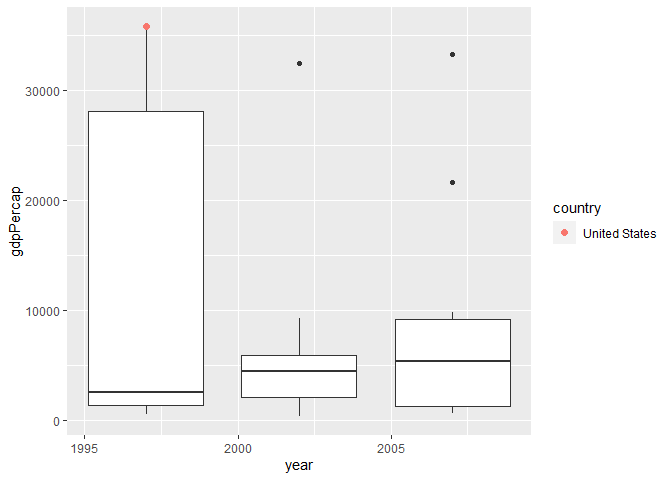

Gapminder
================
(Your name here)
2020-

- <a href="#grading-rubric" id="toc-grading-rubric">Grading Rubric</a>
  - <a href="#individual" id="toc-individual">Individual</a>
  - <a href="#due-date" id="toc-due-date">Due Date</a>
- <a href="#guided-eda" id="toc-guided-eda">Guided EDA</a>
  - <a
    href="#q0-perform-your-first-checks-on-the-dataset-what-variables-are-in-this"
    id="toc-q0-perform-your-first-checks-on-the-dataset-what-variables-are-in-this"><strong>q0</strong>
    Perform your “first checks” on the dataset. What variables are in
    this</a>
  - <a
    href="#q1-determine-the-most-and-least-recent-years-in-the-gapminder-dataset"
    id="toc-q1-determine-the-most-and-least-recent-years-in-the-gapminder-dataset"><strong>q1</strong>
    Determine the most and least recent years in the <code>gapminder</code>
    dataset.</a>
  - <a
    href="#q2-filter-on-years-matching-year_min-and-make-a-plot-of-the-gdp-per-capita-against-continent-choose-an-appropriate-geom_-to-visualize-the-data-what-observations-can-you-make"
    id="toc-q2-filter-on-years-matching-year_min-and-make-a-plot-of-the-gdp-per-capita-against-continent-choose-an-appropriate-geom_-to-visualize-the-data-what-observations-can-you-make"><strong>q2</strong>
    Filter on years matching <code>year_min</code>, and make a plot of the
    GDP per capita against continent. Choose an appropriate
    <code>geom_</code> to visualize the data. What observations can you
    make?</a>
  - <a
    href="#q3-you-should-have-found-at-least-three-outliers-in-q2-but-possibly-many-more-identify-those-outliers-figure-out-which-countries-they-are"
    id="toc-q3-you-should-have-found-at-least-three-outliers-in-q2-but-possibly-many-more-identify-those-outliers-figure-out-which-countries-they-are"><strong>q3</strong>
    You should have found <em>at least</em> three outliers in q2 (but
    possibly many more!). Identify those outliers (figure out which
    countries they are).</a>
  - <a
    href="#q4-create-a-plot-similar-to-yours-from-q2-studying-both-year_min-and-year_max-find-a-way-to-highlight-the-outliers-from-q3-on-your-plot-in-a-way-that-lets-you-identify-which-country-is-which-compare-the-patterns-between-year_min-and-year_max"
    id="toc-q4-create-a-plot-similar-to-yours-from-q2-studying-both-year_min-and-year_max-find-a-way-to-highlight-the-outliers-from-q3-on-your-plot-in-a-way-that-lets-you-identify-which-country-is-which-compare-the-patterns-between-year_min-and-year_max"><strong>q4</strong>
    Create a plot similar to yours from q2 studying both
    <code>year_min</code> and <code>year_max</code>. Find a way to highlight
    the outliers from q3 on your plot <em>in a way that lets you identify
    which country is which</em>. Compare the patterns between
    <code>year_min</code> and <code>year_max</code>.</a>
- <a href="#your-own-eda" id="toc-your-own-eda">Your Own EDA</a>
  - <a
    href="#q5-create-at-least-three-new-figures-below-with-each-figure-try-to-pose-new-questions-about-the-data"
    id="toc-q5-create-at-least-three-new-figures-below-with-each-figure-try-to-pose-new-questions-about-the-data"><strong>q5</strong>
    Create <em>at least</em> three new figures below. With each figure, try
    to pose new questions about the data.</a>

*Purpose*: Learning to do EDA well takes practice! In this challenge
you’ll further practice EDA by first completing a guided exploration,
then by conducting your own investigation. This challenge will also give
you a chance to use the wide variety of visual tools we’ve been
learning.

<!-- include-rubric -->

# Grading Rubric

<!-- -------------------------------------------------- -->

Unlike exercises, **challenges will be graded**. The following rubrics
define how you will be graded, both on an individual and team basis.

## Individual

<!-- ------------------------- -->

| Category    | Needs Improvement                                                                                                | Satisfactory                                                                                                               |
|-------------|------------------------------------------------------------------------------------------------------------------|----------------------------------------------------------------------------------------------------------------------------|
| Effort      | Some task **q**’s left unattempted                                                                               | All task **q**’s attempted                                                                                                 |
| Observed    | Did not document observations, or observations incorrect                                                         | Documented correct observations based on analysis                                                                          |
| Supported   | Some observations not clearly supported by analysis                                                              | All observations clearly supported by analysis (table, graph, etc.)                                                        |
| Assessed    | Observations include claims not supported by the data, or reflect a level of certainty not warranted by the data | Observations are appropriately qualified by the quality & relevance of the data and (in)conclusiveness of the support      |
| Specified   | Uses the phrase “more data are necessary” without clarification                                                  | Any statement that “more data are necessary” specifies which *specific* data are needed to answer what *specific* question |
| Code Styled | Violations of the [style guide](https://style.tidyverse.org/) hinder readability                                 | Code sufficiently close to the [style guide](https://style.tidyverse.org/)                                                 |

## Due Date

<!-- ------------------------- -->

All the deliverables stated in the rubrics above are due **at midnight**
before the day of the class discussion of the challenge. See the
[Syllabus](https://docs.google.com/document/d/1qeP6DUS8Djq_A0HMllMqsSqX3a9dbcx1/edit?usp=sharing&ouid=110386251748498665069&rtpof=true&sd=true)
for more information.

``` r
library(tidyverse)
```

    ## ── Attaching packages ─────────────────────────────────────── tidyverse 1.3.2 ──
    ## ✔ ggplot2 3.4.0      ✔ purrr   1.0.1 
    ## ✔ tibble  3.1.8      ✔ dplyr   1.0.10
    ## ✔ tidyr   1.2.1      ✔ stringr 1.5.0 
    ## ✔ readr   2.1.3      ✔ forcats 0.5.2 
    ## ── Conflicts ────────────────────────────────────────── tidyverse_conflicts() ──
    ## ✖ dplyr::filter() masks stats::filter()
    ## ✖ dplyr::lag()    masks stats::lag()

``` r
library(gapminder)
```

*Background*: [Gapminder](https://www.gapminder.org/about-gapminder/) is
an independent organization that seeks to educate people about the state
of the world. They seek to counteract the worldview constructed by a
hype-driven media cycle, and promote a “fact-based worldview” by
focusing on data. The dataset we’ll study in this challenge is from
Gapminder.

# Guided EDA

<!-- -------------------------------------------------- -->

First, we’ll go through a round of *guided EDA*. Try to pay attention to
the high-level process we’re going through—after this guided round
you’ll be responsible for doing another cycle of EDA on your own!

### **q0** Perform your “first checks” on the dataset. What variables are in this

dataset?

``` r
## TASK: Do your "first checks" here!
?gapminder
```

    ## starting httpd help server ... done

``` r
gapminder %>% 
  glimpse()
```

    ## Rows: 1,704
    ## Columns: 6
    ## $ country   <fct> "Afghanistan", "Afghanistan", "Afghanistan", "Afghanistan", …
    ## $ continent <fct> Asia, Asia, Asia, Asia, Asia, Asia, Asia, Asia, Asia, Asia, …
    ## $ year      <int> 1952, 1957, 1962, 1967, 1972, 1977, 1982, 1987, 1992, 1997, …
    ## $ lifeExp   <dbl> 28.801, 30.332, 31.997, 34.020, 36.088, 38.438, 39.854, 40.8…
    ## $ pop       <int> 8425333, 9240934, 10267083, 11537966, 13079460, 14880372, 12…
    ## $ gdpPercap <dbl> 779.4453, 820.8530, 853.1007, 836.1971, 739.9811, 786.1134, …

**Observations**:

- Variables: Country, Continent, Year, Life Expectancy, Population, GDP
  per capita

### **q1** Determine the most and least recent years in the `gapminder` dataset.

*Hint*: Use the `pull()` function to get a vector out of a tibble.
(Rather than the `$` notation of base R.)

``` r
## TASK: Find the largest and smallest values of `year` in `gapminder`
year_max <- max(gapminder %>% pull(year), na.rm = TRUE)
year_min <- min(gapminder %>% pull(year), na.rm = TRUE)
```

Use the following test to check your work.

``` r
## NOTE: No need to change this
assertthat::assert_that(year_max %% 7 == 5)
```

    ## [1] TRUE

``` r
assertthat::assert_that(year_max %% 3 == 0)
```

    ## [1] TRUE

``` r
assertthat::assert_that(year_min %% 7 == 6)
```

    ## [1] TRUE

``` r
assertthat::assert_that(year_min %% 3 == 2)
```

    ## [1] TRUE

``` r
if (is_tibble(year_max)) {
  print("year_max is a tibble; try using `pull()` to get a vector")
  assertthat::assert_that(False)
}

print("Nice!")
```

    ## [1] "Nice!"

### **q2** Filter on years matching `year_min`, and make a plot of the GDP per capita against continent. Choose an appropriate `geom_` to visualize the data. What observations can you make?

You may encounter difficulties in visualizing these data; if so document
your challenges and attempt to produce the most informative visual you
can.

``` r
## TASK: Create a visual of gdpPercap vs continent
gapminder %>%
  filter(year==year_min) %>% 
  ggplot(aes(x = continent, y = gdpPercap, group = continent)) +
  geom_boxplot()+
  scale_y_log10()
```

<!-- -->

**Observations**:

- There tends to be more higher outliers than lower outliers
- On average, the gdp tends to be pretty low for all the continents,
  with asia and africa being lower. oceania has a pretty high average as
  it only has a few countries and are mostly under western influence.

**Difficulties & Approaches**:

- A lot of asia and africa outliers (and sometimes americas), are very
  squished, i used a log scale on the y to show the different outliers

### **q3** You should have found *at least* three outliers in q2 (but possibly many more!). Identify those outliers (figure out which countries they are).

``` r
## TASK: Identify the outliers from q2
gapminder %>% 
  filter(year==year_min) %>% 
  filter(continent == "Europe") %>% 
  arrange(gdpPercap)
```

    ## # A tibble: 30 × 6
    ##    country                continent  year lifeExp      pop gdpPercap
    ##    <fct>                  <fct>     <int>   <dbl>    <int>     <dbl>
    ##  1 Bosnia and Herzegovina Europe     1952    53.8  2791000      974.
    ##  2 Albania                Europe     1952    55.2  1282697     1601.
    ##  3 Turkey                 Europe     1952    43.6 22235677     1969.
    ##  4 Bulgaria               Europe     1952    59.6  7274900     2444.
    ##  5 Montenegro             Europe     1952    59.2   413834     2648.
    ##  6 Portugal               Europe     1952    59.8  8526050     3068.
    ##  7 Croatia                Europe     1952    61.2  3882229     3119.
    ##  8 Romania                Europe     1952    61.0 16630000     3145.
    ##  9 Greece                 Europe     1952    65.9  7733250     3531.
    ## 10 Serbia                 Europe     1952    58.0  6860147     3581.
    ## # … with 20 more rows

``` r
gapminder %>% 
  filter(year==year_min) %>% 
  filter(continent == "Asia") %>% 
  arrange(desc(gdpPercap))
```

    ## # A tibble: 33 × 6
    ##    country          continent  year lifeExp      pop gdpPercap
    ##    <fct>            <fct>     <int>   <dbl>    <int>     <dbl>
    ##  1 Kuwait           Asia       1952    55.6   160000   108382.
    ##  2 Bahrain          Asia       1952    50.9   120447     9867.
    ##  3 Saudi Arabia     Asia       1952    39.9  4005677     6460.
    ##  4 Lebanon          Asia       1952    55.9  1439529     4835.
    ##  5 Iraq             Asia       1952    45.3  5441766     4130.
    ##  6 Israel           Asia       1952    65.4  1620914     4087.
    ##  7 Japan            Asia       1952    63.0 86459025     3217.
    ##  8 Hong Kong, China Asia       1952    61.0  2125900     3054.
    ##  9 Iran             Asia       1952    44.9 17272000     3035.
    ## 10 Singapore        Asia       1952    60.4  1127000     2315.
    ## # … with 23 more rows

``` r
gapminder %>% 
  filter(year==year_min) %>% 
  filter(continent == "Africa") %>% 
  arrange(desc(gdpPercap))
```

    ## # A tibble: 52 × 6
    ##    country      continent  year lifeExp      pop gdpPercap
    ##    <fct>        <fct>     <int>   <dbl>    <int>     <dbl>
    ##  1 South Africa Africa     1952    45.0 14264935     4725.
    ##  2 Gabon        Africa     1952    37.0   420702     4293.
    ##  3 Angola       Africa     1952    30.0  4232095     3521.
    ##  4 Reunion      Africa     1952    52.7   257700     2719.
    ##  5 Djibouti     Africa     1952    34.8    63149     2670.
    ##  6 Algeria      Africa     1952    43.1  9279525     2449.
    ##  7 Namibia      Africa     1952    41.7   485831     2424.
    ##  8 Libya        Africa     1952    42.7  1019729     2388.
    ##  9 Congo, Rep.  Africa     1952    42.1   854885     2126.
    ## 10 Mauritius    Africa     1952    51.0   516556     1968.
    ## # … with 42 more rows

``` r
gapminder %>% 
  filter(year==year_min) %>% 
  filter(continent == "Americas") %>% 
  arrange(desc(gdpPercap))
```

    ## # A tibble: 25 × 6
    ##    country       continent  year lifeExp       pop gdpPercap
    ##    <fct>         <fct>     <int>   <dbl>     <int>     <dbl>
    ##  1 United States Americas   1952    68.4 157553000    13990.
    ##  2 Canada        Americas   1952    68.8  14785584    11367.
    ##  3 Venezuela     Americas   1952    55.1   5439568     7690.
    ##  4 Argentina     Americas   1952    62.5  17876956     5911.
    ##  5 Uruguay       Americas   1952    66.1   2252965     5717.
    ##  6 Cuba          Americas   1952    59.4   6007797     5587.
    ##  7 Chile         Americas   1952    54.7   6377619     3940.
    ##  8 Peru          Americas   1952    43.9   8025700     3759.
    ##  9 Ecuador       Americas   1952    48.4   3548753     3522.
    ## 10 Mexico        Americas   1952    50.8  30144317     3478.
    ## # … with 15 more rows

``` r
gapminder %>% 
  filter(year==year_min) %>% 
  filter(continent == "Americas") %>% 
  arrange(gdpPercap)
```

    ## # A tibble: 25 × 6
    ##    country            continent  year lifeExp      pop gdpPercap
    ##    <fct>              <fct>     <int>   <dbl>    <int>     <dbl>
    ##  1 Dominican Republic Americas   1952    45.9  2491346     1398.
    ##  2 Haiti              Americas   1952    37.6  3201488     1840.
    ##  3 Paraguay           Americas   1952    62.6  1555876     1952.
    ##  4 Brazil             Americas   1952    50.9 56602560     2109.
    ##  5 Colombia           Americas   1952    50.6 12350771     2144.
    ##  6 Honduras           Americas   1952    41.9  1517453     2195.
    ##  7 Guatemala          Americas   1952    42.0  3146381     2428.
    ##  8 Panama             Americas   1952    55.2   940080     2480.
    ##  9 Costa Rica         Americas   1952    57.2   926317     2627.
    ## 10 Bolivia            Americas   1952    40.4  2883315     2677.
    ## # … with 15 more rows

**Observations**:

- Identify the outlier countries from q2
  - The outliers from Europe are likely Bosina and Herzegovina and
    Albania, The outliers from Asia are mainly Kuwait and Singapore, the
    outliers from Africa are mainly Libya and Gabon
  - 

*Hint*: For the next task, it’s helpful to know a ggplot trick we’ll
learn in an upcoming exercise: You can use the `data` argument inside
any `geom_*` to modify the data that will be plotted *by that geom
only*. For instance, you can use this trick to filter a set of points to
label:

``` r
## NOTE: No need to edit, use ideas from this in q4 below
gapminder %>%
  filter(year == max(year)) %>%

  ggplot(aes(continent, lifeExp)) +
  geom_boxplot() +
  geom_point(
    data = . %>% filter(country %in% c("United Kingdom", "Japan", "Zambia")),
    mapping = aes(color = country),
    size = 2
  )
```

<!-- -->

### **q4** Create a plot similar to yours from q2 studying both `year_min` and `year_max`. Find a way to highlight the outliers from q3 on your plot *in a way that lets you identify which country is which*. Compare the patterns between `year_min` and `year_max`.

*Hint*: We’ve learned a lot of different ways to show multiple
variables; think about using different aesthetics or facets.

``` r
## TASK: Create a visual of gdpPercap vs continent


gapminder %>%
  filter(year == max(year) | year == min(year)) %>%
  ggplot(aes(x = continent, y = gdpPercap)) +
  geom_boxplot() +
  geom_point(
    data = . %>% filter(country %in% c("Bosnia and Herzegovina", "Albania", "Kuwait", "Singapore", "Libya", "Gabon", "United States", "Canada", "Haiti", "China")),
    size = 3,
    show.legend = TRUE
  ) +
  scale_y_log10() +
  facet_wrap(~year) +
  labs(title = "GDP per capita by continent and year",
       x = "Year",
       y = "GDP per capita (log scale)",
       color = "Country",
       shape = "Country") +
  theme_bw()
```

<!-- -->

**Observations**:

- In general all continents saw a drastic increase in gdp except 1
  outlier in americas. the different countries were successfully
  identified and generally stayed the same. i added china for fun and
  there was a very big jump in gdp over the 50 year time span.

# Your Own EDA

<!-- -------------------------------------------------- -->

Now it’s your turn! We just went through guided EDA considering the GDP
per capita at two time points. You can continue looking at outliers,
consider different years, repeat the exercise with `lifeExp`, consider
the relationship between variables, or something else entirely.

### **q5** Create *at least* three new figures below. With each figure, try to pose new questions about the data.

``` r
## TASK: Your first graph
gapminder %>%
  filter(year == max(year)) %>%

  ggplot(aes(continent, pop, group = continent)) +
  geom_boxplot() +
  geom_point(
    data = . %>% filter(country %in% c("Iceland", "Germany", "China", "Australia", "United States", "Nigeria")),
    mapping = aes(color = country),
    size = 2
  )+ 
  scale_y_log10()
```

<!-- -->

- Often times it was easy to assume which countries are on the top
  without looking at the table. However, it is significantly harder to
  guess the smaller countries, as it is oftentimes uncertain how the
  gapminder determines whether or not a country is a country, (ie
  vatican city does not count, so are the other smaller countries).
- A question that I have is all the other continents have very similar
  average populations, but asia seems to have a higher than average
  population than all of the rest

``` r
## TASK: Your second graph
gapminder %>%

  ggplot(aes(year, continent, group = continent)) +
  geom_boxplot() +
  geom_point(
    data = . %>% filter(country %in% c()),
    mapping = aes(color = country),
    size = 2
  )
```

<!-- -->

- The span of all the data from the different countries are within the
  same span of year. I wonder how much the data varies based on the
  different years. There were some major political and natural events
  that happened within the span and different countries would be
  influenced differently.

``` r
## TASK: Your third graph
gapminder %>%
  filter(year == 1997:2007) %>%

  ggplot(aes(year, gdpPercap, group = year)) +
  geom_boxplot() +
  geom_point(
    data = . %>% filter(country %in% c("United States")),
    mapping = aes(color = country),
    size = 2
  )
```

    ## Warning in year == 1997:2007: longer object length is not a multiple of shorter
    ## object length

<!-- -->

- Trying a longer time frame worked! The general GDP dropped by a lot
  after 1997, which is curious because maybe 9/11 did have some impact.
