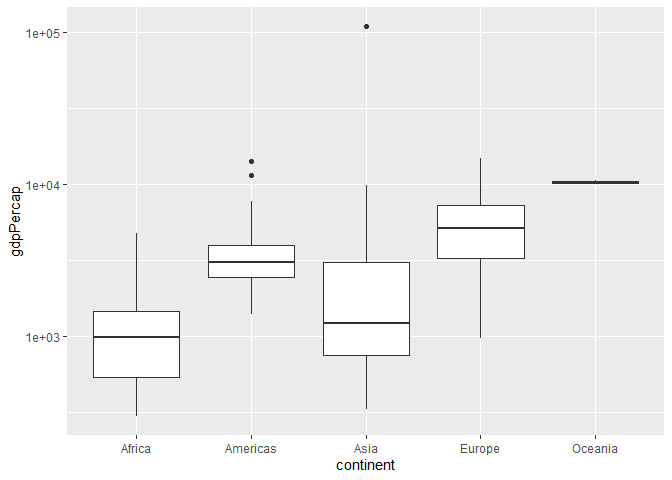
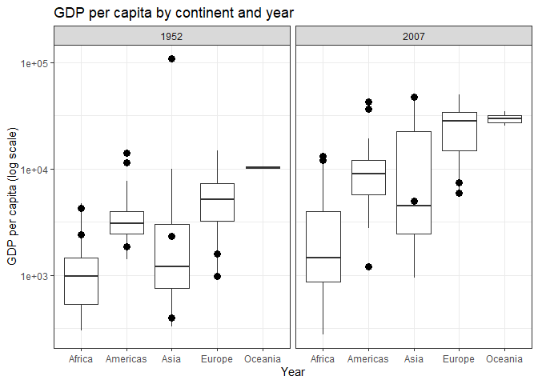

Gapminder
================
(Your name here)
2020-

- <a href="#grading-rubric" id="toc-grading-rubric">Grading Rubric</a>
  - <a href="#individual" id="toc-individual">Individual</a>
  - <a href="#due-date" id="toc-due-date">Due Date</a>
- <a href="#guided-eda" id="toc-guided-eda">Guided EDA</a>
  - <a
    href="#q0-perform-your-first-checks-on-the-dataset-what-variables-are-in-this"
    id="toc-q0-perform-your-first-checks-on-the-dataset-what-variables-are-in-this"><strong>q0</strong>
    Perform your “first checks” on the dataset. What variables are in
    this</a>
  - <a
    href="#q1-determine-the-most-and-least-recent-years-in-the-gapminder-dataset"
    id="toc-q1-determine-the-most-and-least-recent-years-in-the-gapminder-dataset"><strong>q1</strong>
    Determine the most and least recent years in the <code>gapminder</code>
    dataset.</a>
  - <a
    href="#q2-filter-on-years-matching-year_min-and-make-a-plot-of-the-gdp-per-capita-against-continent-choose-an-appropriate-geom_-to-visualize-the-data-what-observations-can-you-make"
    id="toc-q2-filter-on-years-matching-year_min-and-make-a-plot-of-the-gdp-per-capita-against-continent-choose-an-appropriate-geom_-to-visualize-the-data-what-observations-can-you-make"><strong>q2</strong>
    Filter on years matching <code>year_min</code>, and make a plot of the
    GDP per capita against continent. Choose an appropriate
    <code>geom_</code> to visualize the data. What observations can you
    make?</a>
  - <a
    href="#q3-you-should-have-found-at-least-three-outliers-in-q2-but-possibly-many-more-identify-those-outliers-figure-out-which-countries-they-are"
    id="toc-q3-you-should-have-found-at-least-three-outliers-in-q2-but-possibly-many-more-identify-those-outliers-figure-out-which-countries-they-are"><strong>q3</strong>
    You should have found <em>at least</em> three outliers in q2 (but
    possibly many more!). Identify those outliers (figure out which
    countries they are).</a>
  - <a
    href="#q4-create-a-plot-similar-to-yours-from-q2-studying-both-year_min-and-year_max-find-a-way-to-highlight-the-outliers-from-q3-on-your-plot-in-a-way-that-lets-you-identify-which-country-is-which-compare-the-patterns-between-year_min-and-year_max"
    id="toc-q4-create-a-plot-similar-to-yours-from-q2-studying-both-year_min-and-year_max-find-a-way-to-highlight-the-outliers-from-q3-on-your-plot-in-a-way-that-lets-you-identify-which-country-is-which-compare-the-patterns-between-year_min-and-year_max"><strong>q4</strong>
    Create a plot similar to yours from q2 studying both
    <code>year_min</code> and <code>year_max</code>. Find a way to highlight
    the outliers from q3 on your plot <em>in a way that lets you identify
    which country is which</em>. Compare the patterns between
    <code>year_min</code> and <code>year_max</code>.</a>
- <a href="#your-own-eda" id="toc-your-own-eda">Your Own EDA</a>
  - <a
    href="#q5-create-at-least-three-new-figures-below-with-each-figure-try-to-pose-new-questions-about-the-data"
    id="toc-q5-create-at-least-three-new-figures-below-with-each-figure-try-to-pose-new-questions-about-the-data"><strong>q5</strong>
    Create <em>at least</em> three new figures below. With each figure, try
    to pose new questions about the data.</a>

*Purpose*: Learning to do EDA well takes practice! In this challenge
you’ll further practice EDA by first completing a guided exploration,
then by conducting your own investigation. This challenge will also give
you a chance to use the wide variety of visual tools we’ve been
learning.

<!-- include-rubric -->

# Grading Rubric

<!-- -------------------------------------------------- -->

Unlike exercises, **challenges will be graded**. The following rubrics
define how you will be graded, both on an individual and team basis.

## Individual

<!-- ------------------------- -->

| Category    | Needs Improvement                                                                                                | Satisfactory                                                                                                               |
|-------------|------------------------------------------------------------------------------------------------------------------|----------------------------------------------------------------------------------------------------------------------------|
| Effort      | Some task **q**’s left unattempted                                                                               | All task **q**’s attempted                                                                                                 |
| Observed    | Did not document observations, or observations incorrect                                                         | Documented correct observations based on analysis                                                                          |
| Supported   | Some observations not clearly supported by analysis                                                              | All observations clearly supported by analysis (table, graph, etc.)                                                        |
| Assessed    | Observations include claims not supported by the data, or reflect a level of certainty not warranted by the data | Observations are appropriately qualified by the quality & relevance of the data and (in)conclusiveness of the support      |
| Specified   | Uses the phrase “more data are necessary” without clarification                                                  | Any statement that “more data are necessary” specifies which *specific* data are needed to answer what *specific* question |
| Code Styled | Violations of the [style guide](https://style.tidyverse.org/) hinder readability                                 | Code sufficiently close to the [style guide](https://style.tidyverse.org/)                                                 |

## Due Date

<!-- ------------------------- -->

All the deliverables stated in the rubrics above are due **at midnight**
before the day of the class discussion of the challenge. See the
[Syllabus](https://docs.google.com/document/d/1qeP6DUS8Djq_A0HMllMqsSqX3a9dbcx1/edit?usp=sharing&ouid=110386251748498665069&rtpof=true&sd=true)
for more information.

``` r
library(tidyverse)
```

    ## ── Attaching packages ─────────────────────────────────────── tidyverse 1.3.2 ──
    ## ✔ ggplot2 3.4.0      ✔ purrr   1.0.1 
    ## ✔ tibble  3.1.8      ✔ dplyr   1.0.10
    ## ✔ tidyr   1.2.1      ✔ stringr 1.5.0 
    ## ✔ readr   2.1.3      ✔ forcats 0.5.2 
    ## ── Conflicts ────────────────────────────────────────── tidyverse_conflicts() ──
    ## ✖ dplyr::filter() masks stats::filter()
    ## ✖ dplyr::lag()    masks stats::lag()

``` r
library(gapminder)
```

*Background*: [Gapminder](https://www.gapminder.org/about-gapminder/) is
an independent organization that seeks to educate people about the state
of the world. They seek to counteract the worldview constructed by a
hype-driven media cycle, and promote a “fact-based worldview” by
focusing on data. The dataset we’ll study in this challenge is from
Gapminder.

# Guided EDA

<!-- -------------------------------------------------- -->

First, we’ll go through a round of *guided EDA*. Try to pay attention to
the high-level process we’re going through—after this guided round
you’ll be responsible for doing another cycle of EDA on your own!

### **q0** Perform your “first checks” on the dataset. What variables are in this

dataset?

``` r
## TASK: Do your "first checks" here!
?gapminder
```

    ## starting httpd help server ... done

``` r
gapminder %>% 
  glimpse()
```

    ## Rows: 1,704
    ## Columns: 6
    ## $ country   <fct> "Afghanistan", "Afghanistan", "Afghanistan", "Afghanistan", …
    ## $ continent <fct> Asia, Asia, Asia, Asia, Asia, Asia, Asia, Asia, Asia, Asia, …
    ## $ year      <int> 1952, 1957, 1962, 1967, 1972, 1977, 1982, 1987, 1992, 1997, …
    ## $ lifeExp   <dbl> 28.801, 30.332, 31.997, 34.020, 36.088, 38.438, 39.854, 40.8…
    ## $ pop       <int> 8425333, 9240934, 10267083, 11537966, 13079460, 14880372, 12…
    ## $ gdpPercap <dbl> 779.4453, 820.8530, 853.1007, 836.1971, 739.9811, 786.1134, …

**Observations**:

- Variables: Country, Continent, Year, Life Expectancy, Population, GDP
  per capita

### **q1** Determine the most and least recent years in the `gapminder` dataset.

*Hint*: Use the `pull()` function to get a vector out of a tibble.
(Rather than the `$` notation of base R.)

``` r
## TASK: Find the largest and smallest values of `year` in `gapminder`
year_max <- max(gapminder$year, na.rm = TRUE)
year_min <- min(gapminder$year, na.rm = TRUE)
```

Use the following test to check your work.

``` r
## NOTE: No need to change this
assertthat::assert_that(year_max %% 7 == 5)
```

    ## [1] TRUE

``` r
assertthat::assert_that(year_max %% 3 == 0)
```

    ## [1] TRUE

``` r
assertthat::assert_that(year_min %% 7 == 6)
```

    ## [1] TRUE

``` r
assertthat::assert_that(year_min %% 3 == 2)
```

    ## [1] TRUE

``` r
if (is_tibble(year_max)) {
  print("year_max is a tibble; try using `pull()` to get a vector")
  assertthat::assert_that(False)
}

print("Nice!")
```

    ## [1] "Nice!"

### **q2** Filter on years matching `year_min`, and make a plot of the GDP per capita against continent. Choose an appropriate `geom_` to visualize the data. What observations can you make?

You may encounter difficulties in visualizing these data; if so document
your challenges and attempt to produce the most informative visual you
can.

``` r
## TASK: Create a visual of gdpPercap vs continent
gapminder %>%
  ggplot(aes(x = continent, y = gdpPercap, group = continent)) +
  geom_boxplot()+
  scale_y_log10()
```

<!-- -->

**Observations**:

- There tends to be more higher outliers than lower outliers
- On average, Oceania has the highest gdp while africa has the lowest.
  Which to be fair, Oceania probably has the least amount of countries

**Difficulties & Approaches**:

- A lot of asia and africa outliers (and sometimes americas), are very
  squished, i used a log scale on the y to show the different outliers

### **q3** You should have found *at least* three outliers in q2 (but possibly many more!). Identify those outliers (figure out which countries they are).

``` r
## TASK: Identify the outliers from q2
gapminder %>% 
  filter(continent == "Europe") %>% 
  arrange(gdpPercap)
```

    ## # A tibble: 360 × 6
    ##    country                continent  year lifeExp      pop gdpPercap
    ##    <fct>                  <fct>     <int>   <dbl>    <int>     <dbl>
    ##  1 Bosnia and Herzegovina Europe     1952    53.8  2791000      974.
    ##  2 Bosnia and Herzegovina Europe     1957    58.4  3076000     1354.
    ##  3 Albania                Europe     1952    55.2  1282697     1601.
    ##  4 Bosnia and Herzegovina Europe     1962    61.9  3349000     1710.
    ##  5 Albania                Europe     1957    59.3  1476505     1942.
    ##  6 Turkey                 Europe     1952    43.6 22235677     1969.
    ##  7 Bosnia and Herzegovina Europe     1967    64.8  3585000     2172.
    ##  8 Turkey                 Europe     1957    48.1 25670939     2219.
    ##  9 Albania                Europe     1962    64.8  1728137     2313.
    ## 10 Turkey                 Europe     1962    52.1 29788695     2323.
    ## # … with 350 more rows

``` r
gapminder %>% 
  filter(continent == "Asia") %>% 
  arrange(desc(gdpPercap))
```

    ## # A tibble: 396 × 6
    ##    country          continent  year lifeExp     pop gdpPercap
    ##    <fct>            <fct>     <int>   <dbl>   <int>     <dbl>
    ##  1 Kuwait           Asia       1957    58.0  212846   113523.
    ##  2 Kuwait           Asia       1972    67.7  841934   109348.
    ##  3 Kuwait           Asia       1952    55.6  160000   108382.
    ##  4 Kuwait           Asia       1962    60.5  358266    95458.
    ##  5 Kuwait           Asia       1967    64.6  575003    80895.
    ##  6 Kuwait           Asia       1977    69.3 1140357    59265.
    ##  7 Kuwait           Asia       2007    77.6 2505559    47307.
    ##  8 Singapore        Asia       2007    80.0 4553009    47143.
    ##  9 Kuwait           Asia       1997    76.2 1765345    40301.
    ## 10 Hong Kong, China Asia       2007    82.2 6980412    39725.
    ## # … with 386 more rows

``` r
gapminder %>% 
  filter(continent == "Africa") %>% 
  arrange(desc(gdpPercap))
```

    ## # A tibble: 624 × 6
    ##    country  continent  year lifeExp     pop gdpPercap
    ##    <fct>    <fct>     <int>   <dbl>   <int>     <dbl>
    ##  1 Libya    Africa     1977    57.4 2721783    21951.
    ##  2 Gabon    Africa     1977    52.8  706367    21746.
    ##  3 Libya    Africa     1972    52.8 2183877    21011.
    ##  4 Libya    Africa     1967    50.2 1759224    18773.
    ##  5 Libya    Africa     1982    62.2 3344074    17364.
    ##  6 Gabon    Africa     1982    56.6  753874    15113.
    ##  7 Gabon    Africa     1997    60.5 1126189    14723.
    ##  8 Gabon    Africa     1992    61.4  985739    13522.
    ##  9 Gabon    Africa     2007    56.7 1454867    13206.
    ## 10 Botswana Africa     2007    50.7 1639131    12570.
    ## # … with 614 more rows

``` r
gapminder %>% 
  filter(continent == "Americas") %>% 
  arrange(desc(gdpPercap))
```

    ## # A tibble: 300 × 6
    ##    country       continent  year lifeExp       pop gdpPercap
    ##    <fct>         <fct>     <int>   <dbl>     <int>     <dbl>
    ##  1 United States Americas   2007    78.2 301139947    42952.
    ##  2 United States Americas   2002    77.3 287675526    39097.
    ##  3 Canada        Americas   2007    80.7  33390141    36319.
    ##  4 United States Americas   1997    76.8 272911760    35767.
    ##  5 Canada        Americas   2002    79.8  31902268    33329.
    ##  6 United States Americas   1992    76.1 256894189    32004.
    ##  7 United States Americas   1987    75.0 242803533    29884.
    ##  8 Canada        Americas   1997    78.6  30305843    28955.
    ##  9 Canada        Americas   1987    76.9  26549700    26627.
    ## 10 Canada        Americas   1992    78.0  28523502    26343.
    ## # … with 290 more rows

``` r
gapminder %>% 
  filter(continent == "Americas") %>% 
  arrange(gdpPercap)
```

    ## # A tibble: 300 × 6
    ##    country            continent  year lifeExp     pop gdpPercap
    ##    <fct>              <fct>     <int>   <dbl>   <int>     <dbl>
    ##  1 Haiti              Americas   2007    60.9 8502814     1202.
    ##  2 Haiti              Americas   2002    58.1 7607651     1270.
    ##  3 Haiti              Americas   1997    56.7 6913545     1342.
    ##  4 Dominican Republic Americas   1952    45.9 2491346     1398.
    ##  5 Haiti              Americas   1967    46.2 4318137     1452.
    ##  6 Haiti              Americas   1992    55.1 6326682     1456.
    ##  7 Dominican Republic Americas   1957    49.8 2923186     1544.
    ##  8 Dominican Republic Americas   1967    56.8 4049146     1654.
    ##  9 Haiti              Americas   1972    48.0 4698301     1654.
    ## 10 Dominican Republic Americas   1962    53.5 3453434     1662.
    ## # … with 290 more rows

**Observations**:

- Identify the outlier countries from q2
  - The outliers from Europe are likely Bosina and Herzegovina and
    Albania, The outliers from Asia are mainly Kuwait and Singapore, the
    outliers from Africa are mainly Libya and Gabon
  - 

*Hint*: For the next task, it’s helpful to know a ggplot trick we’ll
learn in an upcoming exercise: You can use the `data` argument inside
any `geom_*` to modify the data that will be plotted *by that geom
only*. For instance, you can use this trick to filter a set of points to
label:

``` r
## NOTE: No need to edit, use ideas from this in q4 below
gapminder %>%
  filter(year == max(year)) %>%

  ggplot(aes(continent, lifeExp)) +
  geom_boxplot() +
  geom_point(
    data = . %>% filter(country %in% c("United Kingdom", "Japan", "Zambia")),
    mapping = aes(color = country),
    size = 2
  )
```

<!-- -->

### **q4** Create a plot similar to yours from q2 studying both `year_min` and `year_max`. Find a way to highlight the outliers from q3 on your plot *in a way that lets you identify which country is which*. Compare the patterns between `year_min` and `year_max`.

*Hint*: We’ve learned a lot of different ways to show multiple
variables; think about using different aesthetics or facets.

``` r
## TASK: Create a visual of gdpPercap vs continent
gapminder %>%
  filter(year == max(year)) %>%

  ggplot(aes(continent, gdpPercap, group= continent)) +
  geom_boxplot() +
  geom_point(
    data = . %>% filter(country %in% c("Bosnia and Herzegovina", "Albania", "Kuwait", "Singapore", "Libya", "Gabon", "United States", "Canada", "Haiti")),
    mapping = aes(color = country),
    size = 2
  )+
  scale_y_log10()
```

<!-- -->

**Observations**:

- Most of the outliers were correctly identified, except for Bosnia and
  Herzegovina, Albania, Singapore and Kuuwait, which aren’t as much as
  outliers in their respective continents.

# Your Own EDA

<!-- -------------------------------------------------- -->

Now it’s your turn! We just went through guided EDA considering the GDP
per capita at two time points. You can continue looking at outliers,
consider different years, repeat the exercise with `lifeExp`, consider
the relationship between variables, or something else entirely.

### **q5** Create *at least* three new figures below. With each figure, try to pose new questions about the data.

``` r
## TASK: Your first graph
gapminder %>%
  filter(year == max(year)) %>%

  ggplot(aes(continent, pop, group = continent)) +
  geom_boxplot() +
  geom_point(
    data = . %>% filter(country %in% c("Iceland", "Germany", "China", "Australia", "United States", "Nigeria")),
    mapping = aes(color = country),
    size = 2
  )+ 
  scale_y_log10()
```

<!-- -->

- Often times it was easy to assume which countries are on the top
  without looking at the table. However, it is significantly harder to
  guess the smaller countries, as it is oftentimes uncertain how the
  gapminder determines whether or not a country is a country, (ie
  vatican city does not count, so are the other smaller countries).
- A question that I have is all the other continents have very similar
  average populations, but asia seems to have a higher than average
  population than all of the rest

``` r
## TASK: Your second graph
gapminder %>%

  ggplot(aes(year, continent, group = continent)) +
  geom_boxplot() +
  geom_point(
    data = . %>% filter(country %in% c()),
    mapping = aes(color = country),
    size = 2
  )
```

<!-- -->

- The span of all the data from the different countries are within the
  same span of year. I wonder how much the data varies based on the
  different years. There were some major political and natural events
  that happened within the span and different countries would be
  influenced differently.

``` r
## TASK: Your third graph
gapminder %>%
  filter(year == 2001:2003) %>%

  ggplot(aes(year, gdpPercap, group = year)) +
  geom_boxplot() +
  geom_point(
    data = . %>% filter(country %in% c("United States")),
    mapping = aes(color = country),
    size = 2
  )
```

<!-- -->

- It is happening again and its looking humongo ugly ;-;
