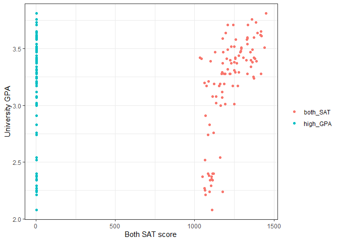
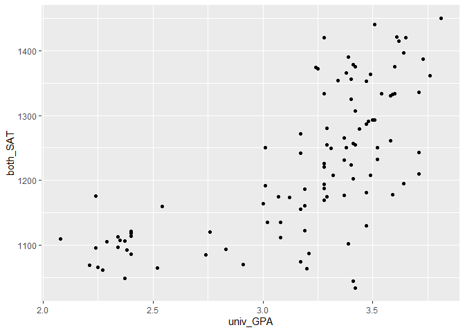
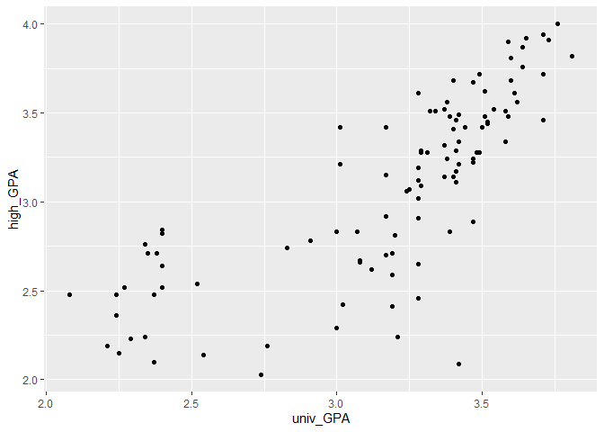
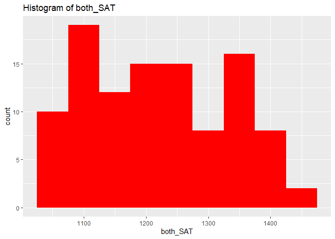
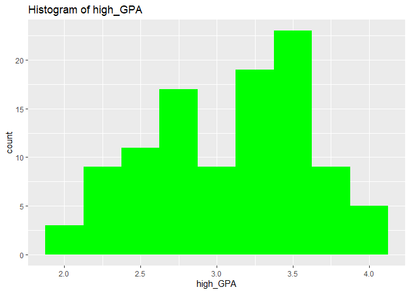
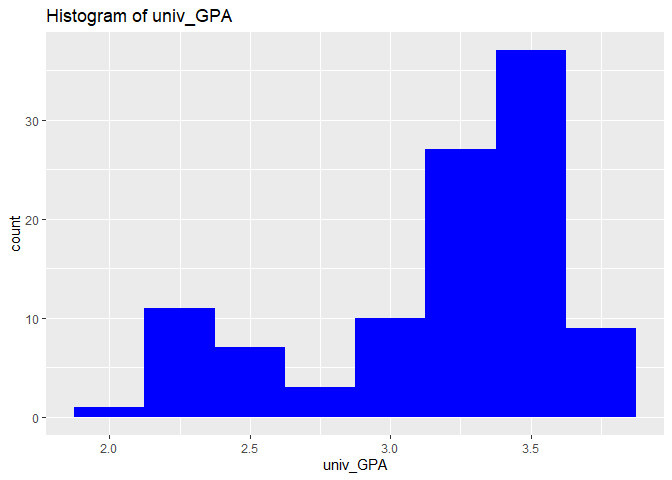

SAT and College Grades
================
(Your name here)
2020-

- <a href="#grading-rubric" id="toc-grading-rubric">Grading Rubric</a>
  - <a href="#individual" id="toc-individual">Individual</a>
  - <a href="#due-date" id="toc-due-date">Due Date</a>
- <a href="#obtain-the-data" id="toc-obtain-the-data">Obtain the Data</a>
  - <a
    href="#q1-visit-the-sat-and-college-gpa-case-study-page-scroll-to-the-bottom-and-click-the-open-data-with-excel-button-this-will-allow-you-to-download-an-xls-file-save-the-file-to-your-data-folder-load-the-data-as-df_sat-and-perform-your-first-checks-against-these-data-answer-the-questions-below"
    id="toc-q1-visit-the-sat-and-college-gpa-case-study-page-scroll-to-the-bottom-and-click-the-open-data-with-excel-button-this-will-allow-you-to-download-an-xls-file-save-the-file-to-your-data-folder-load-the-data-as-df_sat-and-perform-your-first-checks-against-these-data-answer-the-questions-below"><strong>q1</strong>
    Visit the SAT and College GPA case study page, scroll to the bottom, and
    click the <code>Open Data with Excel</code> button. This will allow you
    to download an <code>xls</code> file. Save the file to your
    <code>data</code> folder, load the data as <code>df_sat</code>, and
    perform your “first checks” against these data. Answer the questions
    below:</a>
- <a href="#analysis-with-hypothesis-testing"
  id="toc-analysis-with-hypothesis-testing">Analysis with Hypothesis
  Testing</a>
  - <a href="#view-1-correlations" id="toc-view-1-correlations">View 1:
    Correlations</a>
    - <a
      href="#q2-create-a-single-plot-that-shows-univ_gpa-against-both-high_gpa-and-both_sat-visually-compare-the-two-trends"
      id="toc-q2-create-a-single-plot-that-shows-univ_gpa-against-both-high_gpa-and-both_sat-visually-compare-the-two-trends"><strong>q2</strong>
      Create a <em>single</em> plot that shows <code>univ_GPA</code> against
      <em>both</em> <code>high_GPA</code> and <code>both_SAT</code>. Visually
      compare the two trends.</a>
    - <a href="#hypothesis-testing-with-a-correlation-coefficient"
      id="toc-hypothesis-testing-with-a-correlation-coefficient">Hypothesis
      Testing with a Correlation Coefficient</a>
    - <a
      href="#q3-plot-histograms-for-both_sat-high_gpa-univ_gpa-whichif-anyof-the-variables-look-approximately-normally-distributed"
      id="toc-q3-plot-histograms-for-both_sat-high_gpa-univ_gpa-whichif-anyof-the-variables-look-approximately-normally-distributed"><strong>q3</strong>
      Plot histograms for <code>both_SAT, high_GPA, univ_GPA</code>. Which—if
      any—of the variables look approximately normally distributed.</a>
    - <a
      href="#q4-use-the-function-cortest-to-construct-confidence-intervals-for-corrhigh_gpa-univ_gpa-and-corrboth_sat-univ_gpa-answer-the-questions-below"
      id="toc-q4-use-the-function-cortest-to-construct-confidence-intervals-for-corrhigh_gpa-univ_gpa-and-corrboth_sat-univ_gpa-answer-the-questions-below"><strong>q4</strong>
      Use the function <code>cor.test()</code> to construct confidence
      intervals for <code>corr[high_GPA, univ_GPA</code> and
      <code>corr[both_SAT, univ_GPA]</code>. Answer the questions below.</a>
    - <a
      href="#q5-use-the-bootstrap-to-approximate-a-confidence-interval-for-corrhigh_gpa-univ_gpa-compare-your-resultsboth-the-estimate-and-confidence-intervalto-your-results-from-q4"
      id="toc-q5-use-the-bootstrap-to-approximate-a-confidence-interval-for-corrhigh_gpa-univ_gpa-compare-your-resultsboth-the-estimate-and-confidence-intervalto-your-results-from-q4"><strong>q5</strong>
      Use the bootstrap to approximate a confidence interval for
      <code>corr[high_GPA, univ_GPA</code>. Compare your results—both the
      estimate and confidence interval—to your results from q4.</a>
  - <a href="#view-2-modeling" id="toc-view-2-modeling">View 2: Modeling</a>
    - <a href="#hypothesis-testing-with-a-model"
      id="toc-hypothesis-testing-with-a-model">Hypothesis Testing with a
      Model</a>
    - <a
      href="#q6-fit-a-linear-model-predicting-univ_gpa-with-the-predictor-both_sat-assess-the-model-to-determine-how-effective-a-predictor-both_sat-is-for-univ_gpa-interpret-the-resulting-confidence-interval-for-the-coefficient-on-both_sat"
      id="toc-q6-fit-a-linear-model-predicting-univ_gpa-with-the-predictor-both_sat-assess-the-model-to-determine-how-effective-a-predictor-both_sat-is-for-univ_gpa-interpret-the-resulting-confidence-interval-for-the-coefficient-on-both_sat"><strong>q6</strong>
      Fit a linear model predicting <code>univ_GPA</code> with the predictor
      <code>both_SAT</code>. Assess the model to determine how effective a
      predictor <code>both_SAT</code> is for <code>univ_GPA</code>. Interpret
      the resulting confidence interval for the coefficient on
      <code>both_SAT</code>.</a>
    - <a
      href="#q7-fit-a-model-predicting-univ_gpa-using-both-high_gpa-and-both_sat-compare-the-prediction-accuracy-and-hypothesis-test-results"
      id="toc-q7-fit-a-model-predicting-univ_gpa-using-both-high_gpa-and-both_sat-compare-the-prediction-accuracy-and-hypothesis-test-results"><strong>q7</strong>
      Fit a model predicting <code>univ_GPA</code> using both
      <code>high_GPA</code> and <code>both_SAT</code>. Compare the prediction
      accuracy and hypothesis test results.</a>
  - <a href="#synthesize" id="toc-synthesize">Synthesize</a>
    - <a
      href="#q8-using-the-results-from-all-previous-qs-answer-the-following-questions"
      id="toc-q8-using-the-results-from-all-previous-qs-answer-the-following-questions"><strong>q8</strong>
      Using the results from all previous q’s, answer the following
      questions.</a>
- <a href="#end-notes" id="toc-end-notes">End Notes</a>

*Purpose*: How do we apply hypothesis testing to investigating data? In
this challenge you’ll practice using hypothesis testing tools to make
sense of a dataset.

*Reading*: - [Harvard Study Says SATs Should Be Optional: Here’s
Why](https://www.csmonitor.com/USA/USA-Update/2016/0120/Harvard-study-says-SATs-should-be-optional.-Here-s-why)
(Optional); easy-to-read news article on colleges going SAT-free -
[Norm-Referenced Tests and Race-Blind
Admissions](https://cshe.berkeley.edu/publications/norm-referenced-tests-and-race-blind-admissions-case-eliminating-sat-and-act-university)
(Optional); technical report on relationship between the SAT/ACT and
non-academic factors

*Credit*: This is based on a [case
study](http://onlinestatbook.com/2/case_studies/sat.html) originally
prepared by Emily Zitek, with data collected through the research of
Thomas MacFarland.

``` r
library(tidyverse)
```

    ## ── Attaching packages ─────────────────────────────────────── tidyverse 1.3.2 ──
    ## ✔ ggplot2 3.4.0      ✔ purrr   1.0.1 
    ## ✔ tibble  3.1.8      ✔ dplyr   1.0.10
    ## ✔ tidyr   1.2.1      ✔ stringr 1.5.0 
    ## ✔ readr   2.1.3      ✔ forcats 0.5.2 
    ## ── Conflicts ────────────────────────────────────────── tidyverse_conflicts() ──
    ## ✖ dplyr::filter() masks stats::filter()
    ## ✖ dplyr::lag()    masks stats::lag()

``` r
library(readxl)
library(broom)
library(modelr)
```

    ## 
    ## Attaching package: 'modelr'
    ## 
    ## The following object is masked from 'package:broom':
    ## 
    ##     bootstrap

``` r
library(rsample)
```

<!-- include-rubric -->

# Grading Rubric

<!-- -------------------------------------------------- -->

Unlike exercises, **challenges will be graded**. The following rubrics
define how you will be graded, both on an individual and team basis.

## Individual

<!-- ------------------------- -->

| Category    | Needs Improvement                                                                                                | Satisfactory                                                                                                               |
|-------------|------------------------------------------------------------------------------------------------------------------|----------------------------------------------------------------------------------------------------------------------------|
| Effort      | Some task **q**’s left unattempted                                                                               | All task **q**’s attempted                                                                                                 |
| Observed    | Did not document observations, or observations incorrect                                                         | Documented correct observations based on analysis                                                                          |
| Supported   | Some observations not clearly supported by analysis                                                              | All observations clearly supported by analysis (table, graph, etc.)                                                        |
| Assessed    | Observations include claims not supported by the data, or reflect a level of certainty not warranted by the data | Observations are appropriately qualified by the quality & relevance of the data and (in)conclusiveness of the support      |
| Specified   | Uses the phrase “more data are necessary” without clarification                                                  | Any statement that “more data are necessary” specifies which *specific* data are needed to answer what *specific* question |
| Code Styled | Violations of the [style guide](https://style.tidyverse.org/) hinder readability                                 | Code sufficiently close to the [style guide](https://style.tidyverse.org/)                                                 |

## Due Date

<!-- ------------------------- -->

All the deliverables stated in the rubrics above are due **at midnight**
before the day of the class discussion of the challenge. See the
[Syllabus](https://docs.google.com/document/d/1qeP6DUS8Djq_A0HMllMqsSqX3a9dbcx1/edit?usp=sharing&ouid=110386251748498665069&rtpof=true&sd=true)
for more information.

*Background*: Every year about 2 million students take the Scholastic
Aptitude Test (SAT). The exam is
[controversial](http://www.nea.org/home/73288.htm) but [extremely
consequential](https://www.csmonitor.com/2004/0518/p13s01-legn.html).
There are many claims about the SAT, but we’re going to look at just
one: Is the SAT predictive of scholastic performance in college? It
turns out this is a fairly complicated question to assess—we’ll get an
introduction to some of the complexities.

# Obtain the Data

<!-- -------------------------------------------------- -->

### **q1** Visit the [SAT and College GPA](http://onlinestatbook.com/2/case_studies/sat.html) case study page, scroll to the bottom, and click the `Open Data with Excel` button. This will allow you to download an `xls` file. Save the file to your `data` folder, load the data as `df_sat`, and perform your “first checks” against these data. Answer the questions below:

``` r
## TODO:
df_sat <- read_excel("./data/sat.xls")
## TODO: Do your "first checks"
df_sat %>% glimpse()
```

    ## Rows: 105
    ## Columns: 5
    ## $ high_GPA <dbl> 3.45, 2.78, 2.52, 3.67, 3.24, 2.10, 2.82, 2.36, 2.42, 3.51, 3…
    ## $ math_SAT <dbl> 643, 558, 583, 685, 592, 562, 573, 559, 552, 617, 684, 568, 6…
    ## $ verb_SAT <dbl> 589, 512, 503, 602, 538, 486, 548, 536, 583, 591, 649, 592, 5…
    ## $ comp_GPA <dbl> 3.76, 2.87, 2.54, 3.83, 3.29, 2.64, 2.86, 2.03, 2.81, 3.41, 3…
    ## $ univ_GPA <dbl> 3.52, 2.91, 2.40, 3.47, 3.47, 2.37, 2.40, 2.24, 3.02, 3.32, 3…

**Observations**:

- Fill in the following “data dictionary”

| Column     | Meaning                         |
|------------|---------------------------------|
| `high_GPA` | High school grade point average |
| `math_SAT` | Math SAT score                  |
| `verb_SAT` | Verbal SAT score                |
| `comp_GPA` | Computer Science GPA            |
| `univ_GPA` | Overall university GPA          |

- What information do we have about these students?
  - We know their GPA scores in both university and highschool, their
    specific computer science GPA, and the individual scores of their
    math and verbal sections. Based on the description of the data from
    the authors, we also know that this study examines the SAT and GPA
    information of 105 students who graduated from a state university
    with a B.S. in computer science.
- What kinds of information *do we not have* about these students?
  - Their upbringing, previous exposure to practice problems before
    taking the test, the amount of attempts of taking the test,
    difficulty of their highschool classes/university classes.
- Based on these missing variables, what possible effects could be
  present in the data that we would have *no way of detecting*?
  - students could have taking multiple tests and gotten better scores
    on the SAT, students with access to practice problems or better
    extracirricular materials could have higher GPA and SAT scores, they
    could have taken easier/less challenging courses to get a higher
    GPA, they might have transferred into a CS major from another major,
    etc etc.

# Analysis with Hypothesis Testing

<!-- ----------------------------------------------------------------------- -->

We’re going to use two complementary approaches to analyze the data, the
first based on hypothesis testing of correlation coefficients, and the
second based on fitting a regression model and interpreting the
regression coefficients.

To simplify the analysis, let’s look at a composite SAT score:

``` r
## NOTE: No need to edit this
df_composite <-
  df_sat %>%
  mutate(both_SAT = math_SAT + verb_SAT)
```

## View 1: Correlations

<!-- ----------------------------------------------------------------------- -->

### **q2** Create a *single* plot that shows `univ_GPA` against *both* `high_GPA` and `both_SAT`. Visually compare the two trends.

*Hint*: One way to do this is to first *pivot* `df_composite`.

``` r
## TODO:
df_composite_long <- pivot_longer(df_composite, cols = c("high_GPA", "both_SAT"),
                                  names_to = "variable", values_to = "value")


# Create the scatter plot with a regression line
ggplot(df_composite_long, aes(x = value, y = univ_GPA, color = variable)) +
  geom_point() +
  labs(y = "University GPA", x = "Both SAT score", color = "") +
  theme_bw()
```

<!-- -->

``` r
#I dont like how its not scaled, i tried using the y_scale_continous thing but it didnt work out...

#I made these plots for better observations to answer the questions
ggplot(df_composite, aes(x = univ_GPA, y = both_SAT)) +
  geom_point()
```

<!-- -->

``` r
ggplot(df_composite, aes(x = univ_GPA, y = high_GPA)) +
  geom_point()
```

<!-- -->

**Observations**:

- What relationship do `univ_GPA` and `both_SAT` exhibit?
  - there seems to be a generally positive correlation between the two.
    However, once the university gpa reaches above 3.0, the SAT scores
    are a lot more varied.
- What relationship do `univ_GPA` and `high_GPA` exhibit?
  - it has a similar generally positive correlation between the two. the
    trend is a lot stronger for university gpa above 3.25

### Hypothesis Testing with a Correlation Coefficient

<!-- ------------------------- -->

We can use the idea of hypothesis testing with a correlation
coefficient. The idea is to set our null hypothesis to the case where
there is no correlation, and test to see if the data contradict that
perspective. Formally, the null (H0) and alternative (HA) hypotheses
relating to a correlation coefficient between two variables `X, Y` are:

$$\text{H0: } \text{Corr}[X, Y] = 0$$

$$\text{HA: } \text{Corr}[X, Y] \neq 0$$

The R function `cor.test` implements such a hypothesis test under the
assumption that `X, Y` are both normally distributed. First, let’s check
to see if this assumption looks reasonable for our data.

### **q3** Plot histograms for `both_SAT, high_GPA, univ_GPA`. Which—if any—of the variables look approximately normally distributed.

``` r
ggplot(df_composite, aes(x = both_SAT)) + geom_histogram(binwidth=50, fill = "red") + 
  labs(title = "Histogram of both_SAT")
```

<!-- -->

``` r
ggplot(df_composite, aes(x = high_GPA)) + geom_histogram(binwidth=0.25, fill = "green") + 
  labs(title = "Histogram of high_GPA")
```

<!-- -->

``` r
ggplot(df_composite, aes(x = univ_GPA)) + geom_histogram(binwidth=0.25,fill = "blue") + 
  labs(title = "Histogram of univ_GPA")
```

<!-- -->

**Observations**:

- To what extent does `both_SAT` look like a normal distribution?
  - It doesn’t look super like a normal distribution, there is a more
    distinct curve towards the 1350+ range, but the distribution before
    that seems pretty uniform.
- To what extent does `high_GPA` look like a normal distribution?
  - It looks pretty close to a normal distribution, other than a weird
    gap in the middle around 3.0.
- To what extent does `univ_GPA` look like a normal distribution?
  - It seems pretty skewed to the right and doesn’t look like a normal
    distribution.

Keep in mind your findings as you complete q4.

### **q4** Use the function `cor.test()` to construct confidence intervals for `corr[high_GPA, univ_GPA` and `corr[both_SAT, univ_GPA]`. Answer the questions below.

``` r
## TODO: Use the function cor.test() to test the correlations between
##       high_GPA and univ_GPA, as well as between
##       both_SAT and univ_GPA
# calculate the correlation and confidence intervals for high_GPA and univ_GPA
cor_test_high_univ <- cor.test(df_composite$high_GPA, df_composite$univ_GPA)
cat("Correlation between high_GPA and univ_GPA:", round(cor_test_high_univ$estimate, 2), "\n")
```

    ## Correlation between high_GPA and univ_GPA: 0.78

``` r
cat("Confidence interval for the correlation:", round(cor_test_high_univ$conf.int, 2), "\n")
```

    ## Confidence interval for the correlation: 0.69 0.84

``` r
# calculate the correlation and confidence intervals for both_SAT and univ_GPA
cor_test_both_univ <- cor.test(df_composite$both_SAT, df_composite$univ_GPA)
cat("Correlation between both_SAT and univ_GPA:", round(cor_test_both_univ$estimate, 2), "\n")
```

    ## Correlation between both_SAT and univ_GPA: 0.68

``` r
cat("Confidence interval for the correlation:", round(cor_test_both_univ$conf.int, 2), "\n")
```

    ## Confidence interval for the correlation: 0.57 0.77

**Observations**:

- Which correlations are significantly nonzero?
  - I would say both highschool GPA and both SAT were significantly
    nonzero as neither of the CI’s include 0, meaning they are
    significant.
- Which of `high_GPA` and `both_SAT` seems to be more strongly
  correlated with `univ_GPA`?
  - high_GPA has a higher correlation with a 0.1 stronger correlation.
- How do the results here compare with the visual you created in q2?
  - it is fairly consistent with the observations in q2
- Based on these results, what can we say about the predictive
  capabilities of both `high_GPA` and `both_SAT` to predict `univ_GPA`?
  - both are pretty predictive for university GPA. I would hesitate to
    say that one is distinctively better than another as the confidence
    intervals still overlap a good chunk.

Finally, let’s use the bootstrap to perform the same test using
*different* assumptions.

### **q5** Use the bootstrap to approximate a confidence interval for `corr[high_GPA, univ_GPA`. Compare your results—both the estimate and confidence interval—to your results from q4.

``` r
## TODO: Use the bootstrap to compute a confidence interval for corr[high_GPA, univ_GPA]
corr_fn <- function(data, indices) {
  cor(data[indices, "high_GPA"], data[indices, "univ_GPA"])
}

# set the random seed for reproducibility
set.seed(123)

# perform the bootstrap
n_bootstrap <- 1000
bootstrap_corr <- replicate(n_bootstrap, corr_fn(df_composite, sample(nrow(df_composite), nrow(df_composite), replace = TRUE)))

# calculate the confidence interval
bootstrap_ci <- quantile(bootstrap_corr, c(0.025, 0.975))

# print the results
cat("Bootstrap estimate of correlation:", round(mean(bootstrap_corr), 2), "\n")
```

    ## Bootstrap estimate of correlation: 0.78

``` r
cat("Bootstrap confidence interval:", round(bootstrap_ci, 2))
```

    ## Bootstrap confidence interval: 0.69 0.85

**Observations**:

- How does your estimate from q5 compare with your estimate from q4?
  - Its the same estimate
- How does your CI from q5 compare with your CI from q4?
  - It is basically the same as th q4 estimate, with a slightly higher
    high confidence level.

*Aside*: When you use two different approximations to compute the same
quantity and get similar results, that’s an *encouraging sign*. Such an
outcome lends a bit more credibility to the results.

## View 2: Modeling

<!-- ------------------------- -->

Correlations are useful for relating two variables at a time. To study
the relationship among more variables we can instead use a fitted model.
Using a model, we can also help assess whether it is *worthwhile* to
measure a variable.

To begin, let’s first split the data into training and validation sets.

``` r
## NOTE: No need to edit
set.seed(101)

df_train <-
  df_composite %>%
  rowid_to_column() %>%
  slice_sample(n = 80)

df_validate <-
  df_composite %>%
  rowid_to_column() %>%
  anti_join(
    .,
    df_train,
    by = "rowid"
  )
```

### Hypothesis Testing with a Model

<!-- ------------------------- -->

We can combine the ideas of hypothesis testing with a model. Using a
model, we can express our hypotheses in terms of the model parameters.
For instance, if we were interested in whether $X$ has an affect on $Y$,
we might set up a model:

$$Y_i = \beta X_i + \epsilon_i$$

With the hypotheses:

$$\text{H0}: \beta = 0$$

$$\text{HA}: \beta \neq 0$$

In this case, we’re testing for whether $X$ has a significant effect on
$Y$. Let’s apply this idea to relating the variables `univ_GPA` and
`high_GPA`. Luckily R has built-in tools to construct a confidence
interval on the $\beta$’s in a regression \[1\]; we’ll simply use those
tools rather than do it by hand.

### **q6** Fit a linear model predicting `univ_GPA` with the predictor `both_SAT`. Assess the model to determine how effective a predictor `both_SAT` is for `univ_GPA`. Interpret the resulting confidence interval for the coefficient on `both_SAT`.

``` r
## TODO: Fit a model of univ_GPA on the predictor both_SAT
fit_basic <- lm(univ_GPA ~ both_SAT, data = df_composite)

## Assess the model
summary(fit_basic)
```

    ## 
    ## Call:
    ## lm(formula = univ_GPA ~ both_SAT, data = df_composite)
    ## 
    ## Residuals:
    ##      Min       1Q   Median       3Q      Max 
    ## -0.80781 -0.19511  0.05965  0.18458  0.76093 
    ## 
    ## Coefficients:
    ##               Estimate Std. Error t value Pr(>|t|)    
    ## (Intercept) -0.1716055  0.3522514  -0.487    0.627    
    ## both_SAT     0.0027376  0.0002871   9.534 8.05e-16 ***
    ## ---
    ## Signif. codes:  0 '***' 0.001 '**' 0.01 '*' 0.05 '.' 0.1 ' ' 1
    ## 
    ## Residual standard error: 0.3275 on 103 degrees of freedom
    ## Multiple R-squared:  0.4688, Adjusted R-squared:  0.4636 
    ## F-statistic: 90.89 on 1 and 103 DF,  p-value: 8.052e-16

``` r
## NOTE: The following computes confidence intervals on regression coefficients
fit_basic %>%
  tidy(
    conf.int = TRUE,
    conf.level = 0.99
  )
```

    ## # A tibble: 2 × 7
    ##   term        estimate std.error statistic  p.value conf.low conf.high
    ##   <chr>          <dbl>     <dbl>     <dbl>    <dbl>    <dbl>     <dbl>
    ## 1 (Intercept) -0.172    0.352       -0.487 6.27e- 1 -1.10      0.753  
    ## 2 both_SAT     0.00274  0.000287     9.53  8.05e-16  0.00198   0.00349

**Observations**:

- What is the confidence interval on the coefficient of `both_SAT`? Is
  this coefficient significantly different from zero?
  - 0.00198 to 0.00349
- By itself, how well does `both_SAT` predict `univ_GPA`?
  - by itself it is a ok as the r squaredvalue is 0.46, which is not
    great but not bad either, it is also very unlikely that it occured
    to chance as the p value is very close to 0. roughly for each point
    in increase of SAT score, the students GPA would go up by 0.002

Remember from `e-model03-interp-warnings` that there are challenges with
interpreting regression coefficients! Let’s investigate that idea
further.

### **q7** Fit a model predicting `univ_GPA` using both `high_GPA` and `both_SAT`. Compare the prediction accuracy and hypothesis test results.

``` r
## TODO: Fit and assess models with predictors both_SAT + high_GPA, and high_GPA alone
fit_both <- lm(univ_GPA ~ high_GPA + both_SAT, data = df_composite)

## Assess the model
summary(fit_both)
```

    ## 
    ## Call:
    ## lm(formula = univ_GPA ~ high_GPA + both_SAT, data = df_composite)
    ## 
    ## Residuals:
    ##      Min       1Q   Median       3Q      Max 
    ## -0.68072 -0.13667  0.01137  0.17012  0.92983 
    ## 
    ## Coefficients:
    ##              Estimate Std. Error t value Pr(>|t|)    
    ## (Intercept) 0.5397848  0.3177784   1.699   0.0924 .  
    ## high_GPA    0.5414534  0.0837479   6.465 3.53e-09 ***
    ## both_SAT    0.0007918  0.0003868   2.047   0.0432 *  
    ## ---
    ## Signif. codes:  0 '***' 0.001 '**' 0.01 '*' 0.05 '.' 0.1 ' ' 1
    ## 
    ## Residual standard error: 0.2772 on 102 degrees of freedom
    ## Multiple R-squared:  0.6232, Adjusted R-squared:  0.6158 
    ## F-statistic: 84.35 on 2 and 102 DF,  p-value: < 2.2e-16

``` r
fit_both %>%
  tidy(
    conf.int = TRUE,
    conf.level = 0.99
  )
```

    ## # A tibble: 3 × 7
    ##   term        estimate std.error statistic       p.value  conf.low conf.high
    ##   <chr>          <dbl>     <dbl>     <dbl>         <dbl>     <dbl>     <dbl>
    ## 1 (Intercept) 0.540     0.318         1.70 0.0924        -0.294      1.37   
    ## 2 high_GPA    0.541     0.0837        6.47 0.00000000353  0.322      0.761  
    ## 3 both_SAT    0.000792  0.000387      2.05 0.0432        -0.000224   0.00181

``` r
## Fit the model with high_GPA only
fit_high <- lm(univ_GPA ~ high_GPA, data = df_composite)

## Assess the model
summary(fit_high)
```

    ## 
    ## Call:
    ## lm(formula = univ_GPA ~ high_GPA, data = df_composite)
    ## 
    ## Residuals:
    ##      Min       1Q   Median       3Q      Max 
    ## -0.69040 -0.11922  0.03274  0.17397  0.91278 
    ## 
    ## Coefficients:
    ##             Estimate Std. Error t value Pr(>|t|)    
    ## (Intercept)  1.09682    0.16663   6.583 1.98e-09 ***
    ## high_GPA     0.67483    0.05342  12.632  < 2e-16 ***
    ## ---
    ## Signif. codes:  0 '***' 0.001 '**' 0.01 '*' 0.05 '.' 0.1 ' ' 1
    ## 
    ## Residual standard error: 0.2814 on 103 degrees of freedom
    ## Multiple R-squared:  0.6077, Adjusted R-squared:  0.6039 
    ## F-statistic: 159.6 on 1 and 103 DF,  p-value: < 2.2e-16

``` r
fit_high %>%
  tidy(
    conf.int = TRUE,
    conf.level = 0.99
  )
```

    ## # A tibble: 2 × 7
    ##   term        estimate std.error statistic  p.value conf.low conf.high
    ##   <chr>          <dbl>     <dbl>     <dbl>    <dbl>    <dbl>     <dbl>
    ## 1 (Intercept)    1.10     0.167       6.58 1.98e- 9    0.660     1.53 
    ## 2 high_GPA       0.675    0.0534     12.6  1.18e-22    0.535     0.815

**Observations**:

- How well do these models perform, compared to the one you built in q6?
  - in terms of predictability, it is not drastically different, but
    both models out performed the q6 model by at least 0.1 r2.
- What is the confidence interval on the coefficient of `both_SAT` when
  including `high_GPA` as a predictor?? Is this coefficient
  significantly different from zero?
  - The confidence interval is around \[-0.00022, 0.0018\].It is not
    significantly different from 0, in fact it is very close to 0.
- How do the hypothesis test results compare with the results in q6?
  - The hypothesis test results are similar, though even just high_GPA
    on its own is a more accurate prediction than the SAT scores.

## Synthesize

<!-- ------------------------- -->

Before closing, let’s synthesize a bit from the analyses above.

### **q8** Using the results from all previous q’s, answer the following questions.

**Observations**:

- Between `both_SAT` and `high_GPA`, which single variable would you
  choose to predict `univ_GPA`? Why?
  - I would choose high_GPA because it just outperforms both_SAT in this
    specific scenario. However, it doesnt necessarily mean that it
    should be a global prediction method, as it is just a measurement
    shown to be slightly effective in this specific state university for
    cs majors.
- Is `both_SAT` an effective predictor of `univ_GPA`? What specific
  pieces of evidence do you have in favor of `both_SAT` being effective?
  What specific pieces of evidence do you have against? -both_SAT
  follows a roughly normal distribution, and has a R2 value that is
  significantly non-zero. However, in this specific dataset, the mean
  prediction of highschool GPA is more predictive. It is also worth
  noting that the confidence interval for most measurements between the
  2 variables has some overlap with each other.

# End Notes

<!-- ----------------------------------------------------------------------- -->

\[1\] There are also assumptions underlying this kind of testing, for
more information see this [Wiki
article](https://en.wikipedia.org/wiki/Linear_regression#Assumptions).
