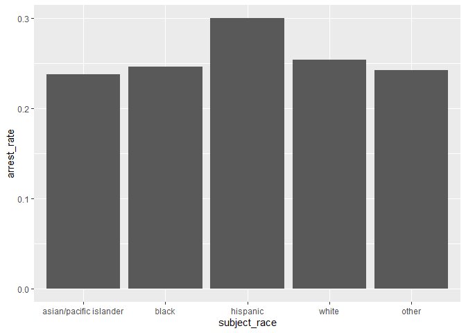
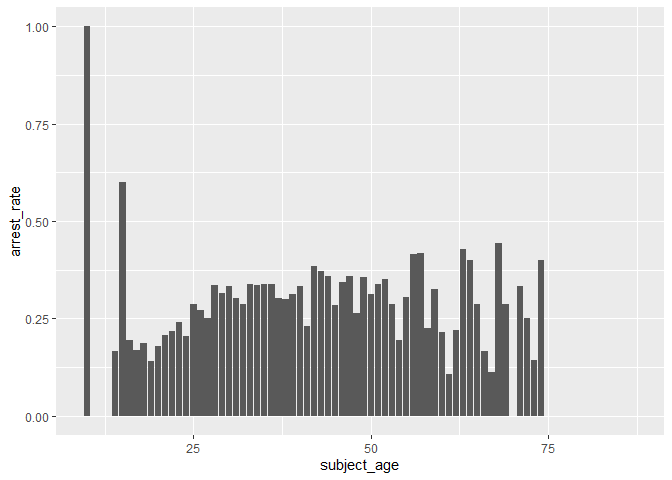
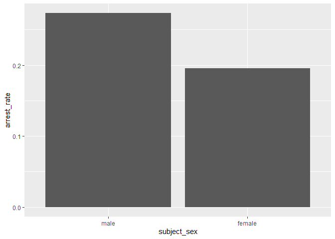
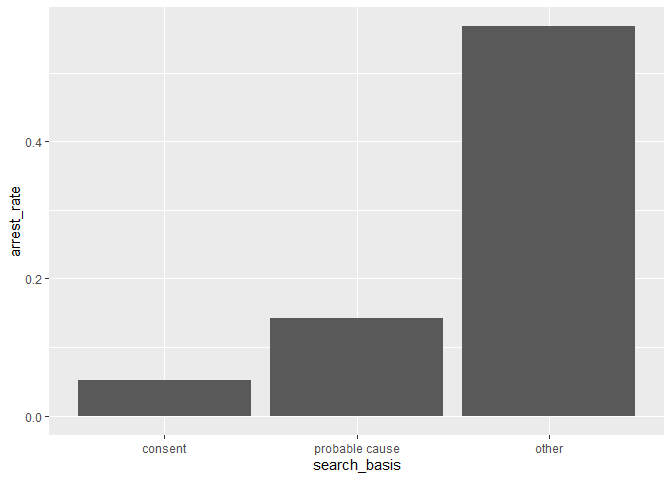

Massachusetts Highway Stops
================
(Your name here)
2020-

- <a href="#grading-rubric" id="toc-grading-rubric">Grading Rubric</a>
  - <a href="#individual" id="toc-individual">Individual</a>
  - <a href="#due-date" id="toc-due-date">Due Date</a>
- <a href="#setup" id="toc-setup">Setup</a>
  - <a
    href="#q1-go-to-the-stanford-open-policing-project-page-and-download-the-massachusetts-state-police-records-in-rds-format-move-the-data-to-your-data-folder-and-match-the-filename-to-load-the-data"
    id="toc-q1-go-to-the-stanford-open-policing-project-page-and-download-the-massachusetts-state-police-records-in-rds-format-move-the-data-to-your-data-folder-and-match-the-filename-to-load-the-data"><strong>q1</strong>
    Go to the Stanford Open Policing Project page and download the
    Massachusetts State Police records in <code>Rds</code> format. Move the
    data to your <code>data</code> folder and match the
    <code>filename</code> to load the data.</a>
- <a href="#eda" id="toc-eda">EDA</a>
  - <a
    href="#q2-do-your-first-checks-on-the-dataset-what-are-the-basic-facts-about-this-dataset"
    id="toc-q2-do-your-first-checks-on-the-dataset-what-are-the-basic-facts-about-this-dataset"><strong>q2</strong>
    Do your “first checks” on the dataset. What are the basic facts about
    this dataset?</a>
  - <a
    href="#q3-check-the-set-of-factor-levels-for-subject_race-and-raw_race-what-do-you-note-about-overlap--difference-between-the-two-sets"
    id="toc-q3-check-the-set-of-factor-levels-for-subject_race-and-raw_race-what-do-you-note-about-overlap--difference-between-the-two-sets"><strong>q3</strong>
    Check the set of factor levels for <code>subject_race</code> and
    <code>raw_Race</code>. What do you note about overlap / difference
    between the two sets?</a>
  - <a
    href="#q4-check-whether-subject_race-and-raw_race-match-for-a-large-fraction-of-cases-which-of-the-two-hypotheses-above-is-most-likely-based-on-your-results"
    id="toc-q4-check-whether-subject_race-and-raw_race-match-for-a-large-fraction-of-cases-which-of-the-two-hypotheses-above-is-most-likely-based-on-your-results"><strong>q4</strong>
    Check whether <code>subject_race</code> and <code>raw_Race</code> match
    for a large fraction of cases. Which of the two hypotheses above is most
    likely, based on your results?</a>
  - <a href="#vis" id="toc-vis">Vis</a>
    - <a
      href="#q5-compare-the-arrest-ratethe-fraction-of-total-cases-in-which-the-subject-was-arrestedacross-different-factors-create-as-many-visuals-or-tables-as-you-need-but-make-sure-to-check-the-trends-across-all-of-the-subject-variables-answer-the-questions-under-observations-below"
      id="toc-q5-compare-the-arrest-ratethe-fraction-of-total-cases-in-which-the-subject-was-arrestedacross-different-factors-create-as-many-visuals-or-tables-as-you-need-but-make-sure-to-check-the-trends-across-all-of-the-subject-variables-answer-the-questions-under-observations-below"><strong>q5</strong>
      Compare the <em>arrest rate</em>—the fraction of total cases in which
      the subject was arrested—across different factors. Create as many
      visuals (or tables) as you need, but make sure to check the trends
      across all of the <code>subject</code> variables. Answer the questions
      under <em>observations</em> below.</a>
- <a href="#modeling" id="toc-modeling">Modeling</a>
  - <a
    href="#q6-run-the-following-code-and-interpret-the-regression-coefficients-answer-the-the-questions-under-observations-below"
    id="toc-q6-run-the-following-code-and-interpret-the-regression-coefficients-answer-the-the-questions-under-observations-below"><strong>q6</strong>
    Run the following code and interpret the regression coefficients. Answer
    the the questions under <em>observations</em> below.</a>
  - <a
    href="#q7-re-fit-the-logistic-regression-from-q6-setting-white-as-the-reference-level-for-subject_race-interpret-the-the-model-terms-and-answer-the-questions-below"
    id="toc-q7-re-fit-the-logistic-regression-from-q6-setting-white-as-the-reference-level-for-subject_race-interpret-the-the-model-terms-and-answer-the-questions-below"><strong>q7</strong>
    Re-fit the logistic regression from q6 setting <code>"white"</code> as
    the reference level for <code>subject_race</code>. Interpret the the
    model terms and answer the questions below.</a>
  - <a
    href="#q8-re-fit-the-model-using-a-factor-indicating-the-presence-of-contraband-in-the-subjects-vehicle-answer-the-questions-under-observations-below"
    id="toc-q8-re-fit-the-model-using-a-factor-indicating-the-presence-of-contraband-in-the-subjects-vehicle-answer-the-questions-under-observations-below"><strong>q8</strong>
    Re-fit the model using a factor indicating the presence of contraband in
    the subject’s vehicle. Answer the questions under <em>observations</em>
    below.</a>
  - <a href="#further-reading" id="toc-further-reading">Further Reading</a>

*Purpose*: In this last challenge we’ll focus on using logistic
regression to study a large, complicated dataset. Interpreting the
results of a model can be challenging—both in terms of the statistics
and the real-world reasoning—so we’ll get some practice in this
challenge.

<!-- include-rubric -->

# Grading Rubric

<!-- -------------------------------------------------- -->

Unlike exercises, **challenges will be graded**. The following rubrics
define how you will be graded, both on an individual and team basis.

## Individual

<!-- ------------------------- -->

| Category    | Needs Improvement                                                                                                | Satisfactory                                                                                                               |
|-------------|------------------------------------------------------------------------------------------------------------------|----------------------------------------------------------------------------------------------------------------------------|
| Effort      | Some task **q**’s left unattempted                                                                               | All task **q**’s attempted                                                                                                 |
| Observed    | Did not document observations, or observations incorrect                                                         | Documented correct observations based on analysis                                                                          |
| Supported   | Some observations not clearly supported by analysis                                                              | All observations clearly supported by analysis (table, graph, etc.)                                                        |
| Assessed    | Observations include claims not supported by the data, or reflect a level of certainty not warranted by the data | Observations are appropriately qualified by the quality & relevance of the data and (in)conclusiveness of the support      |
| Specified   | Uses the phrase “more data are necessary” without clarification                                                  | Any statement that “more data are necessary” specifies which *specific* data are needed to answer what *specific* question |
| Code Styled | Violations of the [style guide](https://style.tidyverse.org/) hinder readability                                 | Code sufficiently close to the [style guide](https://style.tidyverse.org/)                                                 |

## Due Date

<!-- ------------------------- -->

All the deliverables stated in the rubrics above are due **at midnight**
before the day of the class discussion of the challenge. See the
[Syllabus](https://docs.google.com/document/d/1qeP6DUS8Djq_A0HMllMqsSqX3a9dbcx1/edit?usp=sharing&ouid=110386251748498665069&rtpof=true&sd=true)
for more information.

*Background*: We’ll study data from the [Stanford Open Policing
Project](https://openpolicing.stanford.edu/data/), specifically their
dataset on Massachusetts State Patrol police stops.

``` r
library(tidyverse)
```

    ## ── Attaching packages ─────────────────────────────────────── tidyverse 1.3.2 ──
    ## ✔ ggplot2 3.4.0      ✔ purrr   1.0.1 
    ## ✔ tibble  3.1.8      ✔ dplyr   1.0.10
    ## ✔ tidyr   1.2.1      ✔ stringr 1.5.0 
    ## ✔ readr   2.1.3      ✔ forcats 0.5.2 
    ## ── Conflicts ────────────────────────────────────────── tidyverse_conflicts() ──
    ## ✖ dplyr::filter() masks stats::filter()
    ## ✖ dplyr::lag()    masks stats::lag()

``` r
library(broom)
```

# Setup

<!-- -------------------------------------------------- -->

### **q1** Go to the [Stanford Open Policing Project](https://openpolicing.stanford.edu/data/) page and download the Massachusetts State Police records in `Rds` format. Move the data to your `data` folder and match the `filename` to load the data.

*Note*: An `Rds` file is an R-specific file format. The function
`readRDS` will read these files.

``` r
## TODO: Download the data, move to your data folder, and load it
filename <- "./data/yg821jf8611_ma_statewide_2020_04_01.rds"
df_data <- readRDS(filename)
```

# EDA

<!-- -------------------------------------------------- -->

``` r
glimpse(df_data)
```

    ## Rows: 3,416,238
    ## Columns: 24
    ## $ raw_row_number             <chr> "1", "2", "3", "4", "5", "6", "7", "8", "9"…
    ## $ date                       <date> 2007-06-06, 2007-06-07, 2007-06-07, 2007-0…
    ## $ location                   <chr> "MIDDLEBOROUGH", "SEEKONK", "MEDFORD", "MED…
    ## $ county_name                <chr> "Plymouth County", "Bristol County", "Middl…
    ## $ subject_age                <int> 33, 36, 56, 37, 22, 34, 54, 31, 21, 56, 56,…
    ## $ subject_race               <fct> white, white, white, white, hispanic, white…
    ## $ subject_sex                <fct> male, male, female, male, female, male, mal…
    ## $ type                       <fct> vehicular, vehicular, vehicular, vehicular,…
    ## $ arrest_made                <lgl> FALSE, FALSE, FALSE, FALSE, FALSE, FALSE, F…
    ## $ citation_issued            <lgl> TRUE, FALSE, FALSE, FALSE, TRUE, TRUE, TRUE…
    ## $ warning_issued             <lgl> FALSE, TRUE, TRUE, TRUE, FALSE, FALSE, FALS…
    ## $ outcome                    <fct> citation, warning, warning, warning, citati…
    ## $ contraband_found           <lgl> NA, FALSE, NA, NA, NA, NA, NA, NA, NA, NA, …
    ## $ contraband_drugs           <lgl> NA, FALSE, NA, NA, NA, NA, NA, NA, NA, NA, …
    ## $ contraband_weapons         <lgl> NA, FALSE, NA, NA, NA, NA, NA, NA, NA, NA, …
    ## $ contraband_alcohol         <lgl> FALSE, FALSE, FALSE, FALSE, FALSE, FALSE, F…
    ## $ contraband_other           <lgl> NA, FALSE, NA, NA, NA, NA, NA, NA, NA, NA, …
    ## $ frisk_performed            <lgl> NA, FALSE, NA, NA, NA, NA, NA, NA, NA, NA, …
    ## $ search_conducted           <lgl> FALSE, TRUE, FALSE, FALSE, FALSE, FALSE, FA…
    ## $ search_basis               <fct> NA, other, NA, NA, NA, NA, NA, NA, NA, NA, …
    ## $ reason_for_stop            <chr> "Speed", NA, NA, NA, NA, "Speed", NA, NA, N…
    ## $ vehicle_type               <chr> "Passenger", "Commercial", "Passenger", "Co…
    ## $ vehicle_registration_state <fct> MA, MA, MA, MA, MA, MA, MA, MA, MA, MA, MA,…
    ## $ raw_Race                   <chr> "White", "White", "White", "White", "Hispan…

### **q2** Do your “first checks” on the dataset. What are the basic facts about this dataset?

Theres 24 columns involving the dates, location, general subject
information, arrest related information, and vechile type and raw race

Note that we have both a `subject_race` and `race_Raw` column. There are
a few possibilities as to what `race_Raw` represents:

- `race_Raw` could be the race of the police officer in the stop
- `race_Raw` could be an unprocessed version of `subject_race`

Let’s try to distinguish between these two possibilities.

### **q3** Check the set of factor levels for `subject_race` and `raw_Race`. What do you note about overlap / difference between the two sets?

``` r
## TODO: Determine the factor levels for subject_race and raw_Race
levels(df_data$subject_race)
```

    ## [1] "asian/pacific islander" "black"                  "hispanic"              
    ## [4] "white"                  "other"                  "unknown"

``` r
levels(df_data$raw_Race)
```

    ## NULL

**Observations**:

- What are the unique values for `subject_race`? asian/pacific islander,
  black, hispanic, white, other, unknown
- What are the unique values for `raw_Race`? White, Hispanic, Black,
  Asian or Pacific Islander, Middle Eastern or East Indian (South
  Asian), American Indian or Alaskan Native, None - for no operator
  present citations only
- What is the overlap between the two sets? asian/pacific islander,
  black, hispanic, white
- What is the difference between the two sets? other and unknown are
  broken down into more specific races.

### **q4** Check whether `subject_race` and `raw_Race` match for a large fraction of cases. Which of the two hypotheses above is most likely, based on your results?

*Note*: Just to be clear, I’m *not* asking you to do a *statistical*
hypothesis test.

``` r
## TODO: Devise your own way to test the hypothesis posed above.
## Create a contingency table of the two variables
cont_table <- table(df_data$subject_race, df_data$raw_Race)

## Calculate the proportion of cases where the two variables match
match_prop <- sum(diag(cont_table)) / sum(cont_table)

## Print the proportion
match_prop
```

    ## [1] 0

``` r
df_data %>% group_by(subject_race) %>% count(subject_race == str_to_lower(raw_Race)) 
```

    ## # A tibble: 7 × 3
    ## # Groups:   subject_race [7]
    ##   subject_race           `subject_race == str_to_lower(raw_Race)`       n
    ##   <fct>                  <lgl>                                      <int>
    ## 1 asian/pacific islander FALSE                                     166842
    ## 2 black                  TRUE                                      351610
    ## 3 hispanic               TRUE                                      338317
    ## 4 white                  TRUE                                     2529780
    ## 5 other                  FALSE                                      11008
    ## 6 unknown                FALSE                                      17017
    ## 7 <NA>                   NA                                          1664

**Observations**

Between the two hypotheses:

- `race_Raw` could be the race of the police officer in the stop
- `race_Raw` could be an unprocessed version of `subject_race`

which is most plausible, based on your results?

- Based on the results, it seems more plausible that race_Raw is an
  unprocessed version of subject_race. This is because there are only
  three unique values in race_Raw (White, Black, and Hispanic), which
  correspond exactly to the three values in subject_race that are marked
  as TRUE (Black, Hispanic, and White). If race_Raw were truly the race
  of the police officer, we would expect to see a much wider variety of
  values in that column, rather than just three.

## Vis

<!-- ------------------------- -->

### **q5** Compare the *arrest rate*—the fraction of total cases in which the subject was arrested—across different factors. Create as many visuals (or tables) as you need, but make sure to check the trends across all of the `subject` variables. Answer the questions under *observations* below.

(Note: Create as many chunks and visuals as you need)

``` r
## Create a bar plot of mean arrest rate by subject_race


race_summary <-df_data %>%
  group_by(subject_race) %>%
  na.omit(subject_race) %>% 
  summarize(arrest_rate = mean(arrest_made)) %>%
  ggplot(aes(x = subject_race, y = arrest_rate)) +
  geom_col()

## Print the bar plot
race_summary
```

<!-- -->

``` r
age_summary <-df_data %>%
  group_by(subject_age) %>%
  na.omit(subject_age) %>% 
  summarize(arrest_rate = mean(arrest_made)) %>%
  ggplot(aes(x = subject_age, y = arrest_rate)) +
  geom_col()

## Print the bar plot
age_summary
```

<!-- -->

``` r
sex_summary <-df_data %>%
  group_by(subject_sex) %>%
  na.omit(subject_sex) %>% 
  summarize(arrest_rate = mean(arrest_made)) %>%
  ggplot(aes(x = subject_sex, y = arrest_rate)) +
  geom_col()

## Print the bar plot
sex_summary
```

<!-- -->

**Observations**:

- How does `arrest_rate` tend to vary with `subject_age`?
  - There is a spike in arrest rate on 2 very specific younger ages,
    then the arrest rate tends to increase with age
- How does `arrest_rate` tend to vary with `subject_sex`?
  - males tend to have a higher arrest rate of about 0.07.
- How does `arrest_rate` tend to vary with `subject_race`?
  - the other races all tend to have similar arrest rates other than
    hispanic race, which is at least 0.05 higher than all other races

# Modeling

<!-- -------------------------------------------------- -->

We’re going to use a model to study the relationship between `subject`
factors and arrest rate, but first we need to understand a bit more
about *dummy variables*

### **q6** Run the following code and interpret the regression coefficients. Answer the the questions under *observations* below.

``` r
## NOTE: No need to edit; inspect the estimated model terms.
fit_q6 <-
  glm(
    formula = arrest_made ~ subject_age + subject_race + subject_sex,
    data = df_data %>%
      filter(
        !is.na(arrest_made),
        subject_race %in% c("white", "black", "hispanic")
      ),
    family = "binomial"
  )

fit_q6 %>% tidy()
```

    ## # A tibble: 5 × 5
    ##   term                 estimate std.error statistic   p.value
    ##   <chr>                   <dbl>     <dbl>     <dbl>     <dbl>
    ## 1 (Intercept)           -2.67    0.0132      -202.  0        
    ## 2 subject_age           -0.0142  0.000280     -50.5 0        
    ## 3 subject_racehispanic   0.513   0.0119        43.3 0        
    ## 4 subject_racewhite     -0.380   0.0103       -37.0 3.12e-299
    ## 5 subject_sexfemale     -0.755   0.00910      -83.0 0

**Observations**:

- Which `subject_race` levels are included in fitting the model?
  -hispanic black and white
- Which `subject_race` levels have terms in the model?
  - hispanic and white

You should find that each factor in the model has a level *missing* in
its set of terms. This is because R represents factors against a
*reference level*: The model treats one factor level as “default”, and
each factor model term represents a change from that “default” behavior.
For instance, the model above treats `subject_sex==male` as the
reference level, so the `subject_sexfemale` term represents the *change
in probability* of arrest due to a person being female (rather than
male).

The this reference level approach to coding factors is necessary for
[technical
reasons](https://www.andrew.cmu.edu/user/achoulde/94842/lectures/lecture10/lecture10-94842.html#why-is-one-of-the-levels-missing-in-the-regression),
but it complicates interpreting the model results. For instance; if we
want to compare two levels, neither of which are the reference level, we
have to consider the difference in their model coefficients. But if we
want to compare all levels against one “baseline” level, then we can
relevel the data to facilitate this comparison.

By default `glm` uses the first factor level present as the reference
level. Therefore we can use
`mutate(factor = fct_relevel(factor, "desired_level"))` to set our
`"desired_level"` as the reference factor.

### **q7** Re-fit the logistic regression from q6 setting `"white"` as the reference level for `subject_race`. Interpret the the model terms and answer the questions below.

``` r
## TODO: Re-fit the logistic regression, but set "white" as the reference
## level for subject_race
## Refit the logistic regression with "white" as the reference level for subject_rac
  

fit_q7 <- glm(arrest_made ~ subject_race + subject_sex + subject_age, data = df_data, family = "binomial")
fit_q7 %>% tidy() %>% mutate(fct_relevel("white"))
```

    ## # A tibble: 8 × 6
    ##   term                 estimate std.error statistic   p.value fct_relevel("whi…¹
    ##   <chr>                   <dbl>     <dbl>     <dbl>     <dbl> <fct>             
    ## 1 (Intercept)           -3.43    0.0217     -158.   0         white             
    ## 2 subject_raceblack      0.768   0.0217       35.5  1.25e-275 white             
    ## 3 subject_racehispanic   1.28    0.0209       61.3  0         white             
    ## 4 subject_racewhite      0.389   0.0200       19.4  7.72e- 84 white             
    ## 5 subject_raceother      0.364   0.0709        5.14 2.81e-  7 white             
    ## 6 subject_raceunknown   -1.55    0.315        -4.91 9.33e-  7 white             
    ## 7 subject_sexfemale     -0.751   0.00896     -83.8  0         white             
    ## 8 subject_age           -0.0144  0.000277    -52.0  0         white             
    ## # … with abbreviated variable name ¹​`fct_relevel("white")`

``` r
## Print the summary of the fitted model
summary(fit_q7)
```

    ## 
    ## Call:
    ## glm(formula = arrest_made ~ subject_race + subject_sex + subject_age, 
    ##     family = "binomial", data = df_data)
    ## 
    ## Deviance Residuals: 
    ##     Min       1Q   Median       3Q      Max  
    ## -0.4384  -0.2578  -0.2221  -0.1792   3.6590  
    ## 
    ## Coefficients:
    ##                        Estimate Std. Error  z value Pr(>|z|)    
    ## (Intercept)          -3.4310131  0.0217352 -157.855  < 2e-16 ***
    ## subject_raceblack     0.7680464  0.0216511   35.474  < 2e-16 ***
    ## subject_racehispanic  1.2806877  0.0208936   61.296  < 2e-16 ***
    ## subject_racewhite     0.3885906  0.0200305   19.400  < 2e-16 ***
    ## subject_raceother     0.3639849  0.0708738    5.136 2.81e-07 ***
    ## subject_raceunknown  -1.5473077  0.3154343   -4.905 9.33e-07 ***
    ## subject_sexfemale    -0.7507356  0.0089580  -83.806  < 2e-16 ***
    ## subject_age          -0.0143870  0.0002768  -51.985  < 2e-16 ***
    ## ---
    ## Signif. codes:  0 '***' 0.001 '**' 0.01 '*' 0.05 '.' 0.1 ' ' 1
    ## 
    ## (Dispersion parameter for binomial family taken to be 1)
    ## 
    ##     Null deviance: 822776  on 3254483  degrees of freedom
    ## Residual deviance: 798546  on 3254476  degrees of freedom
    ##   (161754 observations deleted due to missingness)
    ## AIC: 798562
    ## 
    ## Number of Fisher Scoring iterations: 7

**Observations**:

- Which `subject_race` level has the highest probability of being
  arrested, according to this model? Which has the lowest probability?
  - according to this model, hispanics have the highest probability of
    being arrested, and asian/pacific isladers have the lowest
    probability
- What could explain this difference in probabilities of arrest across
  race? List **multiple** possibilities.
  - well people could be predisposed to react to a certain race a
    certain way (aka racist), they could also have different base
    numbers, for example there might be less other races than white or
    smth, certain races might also be more or less prevalent with
    vehicle related professions.
- Look at the sent of variables in the dataset; do any of the columns
  relate to a potential explanation you listed?
  - being black, hispanic, of unknown race or a female all seem to have
    impact on one’s chances of getting arrested.

One way we can explain differential arrest rates is to include some
measure indicating the presence of an arrestable offense. We’ll do this
in a particular way in the next task.

### **q8** Re-fit the model using a factor indicating the presence of contraband in the subject’s vehicle. Answer the questions under *observations* below.

``` r
## TODO: Repeat the modeling above, but control for whether contraband was found
## during the police stop

## Fit the logistic regression with contraband as a predictor variable
fit_q8 <- glm(arrest_made ~ subject_race + subject_sex + subject_age + contraband_found, data = df_data, family = "binomial")
fit_q8 %>% tidy()
```

    ## # A tibble: 9 × 5
    ##   term                 estimate std.error statistic   p.value
    ##   <chr>                   <dbl>     <dbl>     <dbl>     <dbl>
    ## 1 (Intercept)           -1.73    0.0641     -27.1   3.47e-161
    ## 2 subject_raceblack     -0.0139  0.0621      -0.224 8.23e-  1
    ## 3 subject_racehispanic   0.257   0.0607       4.24  2.28e-  5
    ## 4 subject_racewhite      0.0386  0.0585       0.660 5.09e-  1
    ## 5 subject_raceother     -0.253   0.157       -1.60  1.09e-  1
    ## 6 subject_raceunknown  -10.8    49.0         -0.221 8.25e-  1
    ## 7 subject_sexfemale     -0.311   0.0254     -12.3   1.25e- 34
    ## 8 subject_age            0.0219  0.000851    25.7   2.71e-145
    ## 9 contraband_foundTRUE   0.603   0.0189      31.9   1.76e-223

``` r
## Print the summary of the fitted model
summary(fit_q8)
```

    ## 
    ## Call:
    ## glm(formula = arrest_made ~ subject_race + subject_sex + subject_age + 
    ##     contraband_found, family = "binomial", data = df_data)
    ## 
    ## Deviance Residuals: 
    ##     Min       1Q   Median       3Q      Max  
    ## -1.5241  -0.9161  -0.7633   1.3390   1.9936  
    ## 
    ## Coefficients:
    ##                        Estimate Std. Error z value Pr(>|z|)    
    ## (Intercept)          -1.735e+00  6.412e-02 -27.054  < 2e-16 ***
    ## subject_raceblack    -1.389e-02  6.211e-02  -0.224    0.823    
    ## subject_racehispanic  2.570e-01  6.068e-02   4.235 2.28e-05 ***
    ## subject_racewhite     3.863e-02  5.851e-02   0.660    0.509    
    ## subject_raceother    -2.525e-01  1.574e-01  -1.605    0.109    
    ## subject_raceunknown  -1.080e+01  4.896e+01  -0.221    0.825    
    ## subject_sexfemale    -3.115e-01  2.538e-02 -12.274  < 2e-16 ***
    ## subject_age           2.185e-02  8.515e-04  25.667  < 2e-16 ***
    ## contraband_foundTRUE  6.028e-01  1.889e-02  31.913  < 2e-16 ***
    ## ---
    ## Signif. codes:  0 '***' 0.001 '**' 0.01 '*' 0.05 '.' 0.1 ' ' 1
    ## 
    ## (Dispersion parameter for binomial family taken to be 1)
    ## 
    ##     Null deviance: 69505  on 55025  degrees of freedom
    ## Residual deviance: 67721  on 55017  degrees of freedom
    ##   (3361212 observations deleted due to missingness)
    ## AIC: 67739
    ## 
    ## Number of Fisher Scoring iterations: 10

**Observations**:

- How does controlling for found contraband affect the `subject_race`
  terms in the model?
  - it removes the asian pacific race for a factor, and increases the p
    value of races in general
- What does the *finding of contraband* tell us about the stop? What
  does it *not* tell us about the stop?
  - It still doesnt tell us if the stop or the prompt of searching of
    contraband was racially motivated or not. \### **q9** Go deeper:
    Pose at least one more question about the data and fit at least one
    more model in support of answering that question.

``` r
search_summary <-df_data %>%
  group_by(search_basis) %>%
  na.omit(search_basis) %>% 
  summarize(arrest_rate = mean(arrest_made)) %>%
  ggplot(aes(x = search_basis, y = arrest_rate)) +
  geom_col()

## Print the bar plot
search_summary
```

<!-- -->

``` r
fit_q9 <- glm(arrest_made ~ subject_race + subject_sex + contraband_drugs, data = df_data, family = "binomial")
fit_q9 %>% tidy()
```

    ## # A tibble: 8 × 5
    ##   term                  estimate std.error statistic  p.value
    ##   <chr>                    <dbl>     <dbl>     <dbl>    <dbl>
    ## 1 (Intercept)           -0.916      0.0565   -16.2   4.05e-59
    ## 2 subject_raceblack      0.00994    0.0611     0.163 8.71e- 1
    ## 3 subject_racehispanic   0.268      0.0597     4.49  7.25e- 6
    ## 4 subject_racewhite      0.0989     0.0575     1.72  8.55e- 2
    ## 5 subject_raceother     -0.0513     0.145     -0.354 7.23e- 1
    ## 6 subject_raceunknown  -10.6       50.5       -0.209 8.35e- 1
    ## 7 subject_sexfemale     -0.325      0.0250   -13.0   8.65e-39
    ## 8 contraband_drugsTRUE   0.353      0.0189    18.7   2.55e-78

``` r
## Print the summary of the fitted model
summary(fit_q9)
```

    ## 
    ## Call:
    ## glm(formula = arrest_made ~ subject_race + subject_sex + contraband_drugs, 
    ##     family = "binomial", data = df_data)
    ## 
    ## Deviance Residuals: 
    ##     Min       1Q   Median       3Q      Max  
    ## -1.0552  -0.9173  -0.8554   1.3795   1.7521  
    ## 
    ## Coefficients:
    ##                        Estimate Std. Error z value Pr(>|z|)    
    ## (Intercept)           -0.915799   0.056484 -16.213  < 2e-16 ***
    ## subject_raceblack      0.009942   0.061088   0.163   0.8707    
    ## subject_racehispanic   0.267780   0.059691   4.486 7.25e-06 ***
    ## subject_racewhite      0.098885   0.057513   1.719   0.0855 .  
    ## subject_raceother     -0.051305   0.144748  -0.354   0.7230    
    ## subject_raceunknown  -10.550550  50.519824  -0.209   0.8346    
    ## subject_sexfemale     -0.325179   0.024963 -13.026  < 2e-16 ***
    ## contraband_drugsTRUE   0.353445   0.018865  18.735  < 2e-16 ***
    ## ---
    ## Signif. codes:  0 '***' 0.001 '**' 0.01 '*' 0.05 '.' 0.1 ' ' 1
    ## 
    ## (Dispersion parameter for binomial family taken to be 1)
    ## 
    ##     Null deviance: 70218  on 55625  degrees of freedom
    ## Residual deviance: 69577  on 55618  degrees of freedom
    ##   (3360612 observations deleted due to missingness)
    ## AIC: 69593
    ## 
    ## Number of Fisher Scoring iterations: 10

**Observations**:

- A very odd observation that the other section is so much higher than
  probable cause (\~4 times as high), which might give us some insight
  to the reasons for searching are often not justified by an
  observation, but potentially implicit bias
- this fit model shows than being hispanic almost has the same impact on
  u getting arrested as having drugs.

## Further Reading

<!-- -------------------------------------------------- -->

- Stanford Open Policing Project
  [findings](https://openpolicing.stanford.edu/findings/).
